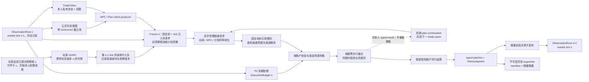

# ADR-0018：超长运行、不可变时间线与统一交易者观察模型

> 2026-09-25 范围补充：[ADR-0019](0019-draft-market-scope-and-capacity.md) 确定最小事实存档、取消任意订单/请求数量配额，以及服务端固定两局、当前不做多局测试。相关条款以该决定为准。

- **状态：** proposed
- **日期：** 2026-09-23
- **决策者：** msuad（2026-09-24 明确局部冲突规则；2026-09-25 明确 NPC、玩家跨 tick 入队时点及撤单反馈；其余冲突项仍待逐项确认）
- **记录范围：** 单 world/session 的长期稳态性能、历史保存、长期计划、玩家/NPC 观察语义、持久化与并行边界
- **若接受：** 部分取代 ADR-0017 的 P0/P2 决策可见性；永久历史粒度和持久化水位裁决完成前不得
  转为 accepted

## 给第一次阅读这份文档的人

本文是一份**提议**，不是已经完成的功能清单，也不是已经获准的全部交易规则。它讨论的是：
一局股票模拟运行几十年以后，系统怎样在保留过去资料的同时，仍然高效地推进下一次市场计算；
玩家和程序控制的交易者怎样知道自己依据的是哪一个已经发生的市场版本；以及哪些计算可以同时
使用多个 CPU 核。文末明确列出还需要产品和架构负责人决定的问题。没有得到决定的地方，正文
所说的结构和规则都只代表建议。

可以先想象一局从 2030 年开始的游戏。它有股票 600001 和 000001，有玩家甲、NPC 乙和 NPC 丙。
乙计划持有 600001 三十年，只在每季度末或公司发布重要公告时重新评估。2035 年的一个普通上午，
甲看见页面显示的上一轮价格是 10.00 元，提出以 10.00 元买入 100 股；乙也可能按它上一轮
看到的资料提出一笔买单。系统收齐本轮已经接受的请求，检查各自账户、按股票处理订单、计算
成交和余额，然后一次性发布新的市场版本。第 30 年的这一轮不应重新检查乙三十年来每天的全部
旧计划记录，也不应为了追加一根新 K 线而重新复制前三十年的 K 线。但是，甲和乙以后仍应能
查询被承诺保存的那段旧行情；只是旧资料不必一直占着内存。

本文反复使用以下词语，含义固定：

| 词语 | 在本文中的具体意思 |
| --- | --- |
| 世界或 session | 一局独立的模拟，包括其股票、账户、时间、公司资料、订单和存档；不是服务器上的所有游戏之和。 |
| tick | 市场向前推进的一次逻辑计算。它不等于现实的一秒，也不等于页面刷新一次。 |
| 已提交版本 | 一次市场计算或日期/披露更新已全部完成并通过校验后，对读取者开放的状态。未完成的中间结果不是已提交版本。 |
| 观察 | 玩家或 NPC 根据某个已提交版本读取公开行情及自己有权读取的私有资料，并据此决定是否提交请求。 |
| 意图或请求 | “按某价格买入某数量”“撤销某订单”等尚未保证通过校验、更未保证成交的动作提议。 |
| 权威状态 | 下一轮计算、存档恢复和交易结果必须以之为准的数据，包括订单、资金、持仓、计划、历史截止位置等。 |
| 热路径 | 每推进一个普通 tick 都必须执行的步骤；如果这些步骤反复遍历全部过去，运行越久就越慢。 |
| 热数据、冷数据 | 热数据是当前计算常用、保留在内存的小部分；冷数据是仍可查询、通常存于长期存储的旧资料。“冷”不表示可以删除。 |
| 窗口 | 某项计算眼下需要的有限历史范围，例如最近 30 个分钟点；它不是交易者能查询到的历史总范围。 |
| 根和页 | 根是进入某一版本各类数据的目录；页是目录下固定或有界大小的数据块。根不是每次都复制整局世界的大对象。 |

为避免将三件不同的事混在一起，下文始终区分：**交易规则**（例如目前项目所建模的 A 股申报、
T+1 和交易阶段）、**观察规则**（在计算本轮决定时能看见哪个版本）、**存储和计算方式**
（旧记录放在哪里、并行任务怎样执行）。本文主要提出后两者的改进，不授权改变前者。若某项
观察规则与既有 ADR-0017 不同，本文会明确指出这一冲突，而不是称它为没有行为变化的优化。

## 1. 上下文

### 1.1 先说明本文所说的“世界”“交易者”和“一步”

一个 `world` 或 `session` 是一局独立运行的股票模拟。它有自己的股票、订单簿、玩家账户、NPC
账户、公司经营资料、交易日历、随机数状态和存档。两局游戏即使在同一台服务器上运行，也不能
共用可变的账户余额、订单编号或随机数状态。本文讨论的是**单独一局**如何长时间运行，以及这
一局内部可以怎样利用多核计算；同时运行很多局所获得的并行度是另一个问题。

`tick` 是引擎推进市场的一次逻辑步骤，不是电脑时钟的一秒，也不是网页刷新一次。一个 tick
可以处理本次到达的委托、撤单、股票撮合、资金和持仓结算，并形成一个新的完整市场状态。假设
第 100 个 tick 已经成功提交，接下来引擎要计算第 101 个 tick；本文将前者记作 `S[100]`，
后者完成后记作 `S[101]`。`S[100]` 包括当时的盘口、账户、计划、公司公开信息和截至该点的
历史。提交的意思是本次计算已经完整通过检查，之后的读取者可以把它当作一个确定的版本。

NPC 是由程序控制的交易者。它可以拥有自己的现金、持仓、关注股票、已获知公告、经验和交易
计划。玩家也是交易者，差别在于玩家通过页面或请求表达决定，而 NPC 由策略程序计算决定。
二者最终都应把“买入多少股、以什么价格申报”“撤销哪张订单”等意图交给同一套账户校验、
撮合和结算规则。公开行情对所有交易者相同，个人账户和未公开信息则必须按身份隔离。

### 1.2 用户希望达到的长期运行效果

用户希望这一局可以连续模拟数十年甚至更久。假设游戏开始时有 5 只股票、20,000 个 NPC，
其中本 tick 只有 8 个 NPC 要观察行情，只有 2 只股票有新委托。经过 30 年，如果股票数、
活跃账户数、当天到期的计划数和新委托数量仍接近这些数字，计算这个普通 tick 不应仅因为
系统已经保存了 30 年历史而比开局慢很多。启动时建立索引、把常用数据读入缓存，可以有一段
轻微的预热期；预热之后，普通 tick 的耗时应落入稳定范围。

这里说的“性能稳定”不是声称每一个 tick 耗时完全相等。某天突然有数千个计划同时复核、
某股出现大量订单、某个投资者确实请求读取 30 年逐笔数据，都意味着这次有更多真实工作。
目标是消除另一类额外成本：一个普通 tick 本来只触及少数账户，却因为历史已经很长而重新
复制全体账户、重新扫描所有旧计划、重新序列化全部日 K 和公告。这种随世界年龄增长的工作
没有提供本 tick 所需的新结果。

长期运行还必须保留真实的过去。一位长期投资者可能持有某只股票几十年，每季度才复核一次，
并在复核时查看其持有期间的全部日 K、财报和自己当年形成判断时所知道的信息。这里的窗口
只能表示“眼下计算某个短期指标所需的最近一段数据”，例如最近 30 分钟的价格；它不能决定
长期计划的寿命，也不能把已经承诺保存的旧日 K 永久删除。

### 1.3 每位交易者看到的时间截点

NPC 在第 `n-1` 个 tick 根据当时已提交的观察版本产生挂单请求；这些请求到第 `n` 个 tick
才受理。玩家在第 `n` 个 tick 异步入队的请求，按该账户实际接收先后排队，到第 `n+1` 个
tick 才参与批量交易并更新状态。异步只指入队，不表示接收时立即撮合。观察版本一旦选定，
不能被之后的撮合改写。比如第 101 个 tick 中，NPC A 的买单先成交，使股价从 10 元变为
10.10 元；NPC B 若依据 `S[100]` 已产生请求，其内容不因线程晚启动而被改写。玩家请求
必须标明页面实际展示的已提交版本，不能把旧页面的报价冒充为刚发生的价格。

这个“只读版本”是共同引用的**逻辑版本**，不是每做一个 tick 就把全世界逐字节复制一份，
也不是给每个 NPC 单独复制一份。历史记录可以在其他内存页或持久化存储中；版本中的指针、
索引和结束位置保证读取者只见到自己有权读取、且在该版本已经发生的内容。

用户所说的“从负无穷到 `n-1` 的历史”，在实际系统里应解释为：从这一局被明确创建的
`TimelineGenesis`，包括选择导入的开局前历史，到观察版本为止的全部**已承诺保存**的记录。
系统无法知道它创建之前不存在于存档中的无限过去。因此询问 Genesis 以前的记录时，应明确
回答 `BeforeGenesis/Unavailable`，不能用第一根已知 K 线反复填充未知的早期数据。
当前新局还会为每只股票生成一段带随机种子的**合成预置日 K**，它不是从真实交易所导入的
旧行情。未来若支持导入外部开局前史，也应与合成预置历史、本局运行后形成的真实游戏记录
分别标明来源和实际覆盖区间。所谓“完整历史”只能覆盖这局真正拥有、且明确承诺保存的
记录；不能把合成价格说成历史真实股价，也不能把两段记录之间不存在的年份补成已知数据。

普通 NPC 一次报价复核中的“撤旧单、报新单”同样有真实先后关系。待执行队列保存这组
操作的明确依赖，读档后继续保留；普通独立撤单不会因此进入全账户的资金队列。关系只保证
该股先处理撤单、再处理新申报，不回补本 tick 的账户预算。若撤单被拒绝，仍返回
对应业务结果，新申报按已有校验和撮合规则处理。

### 1.4 线程由谁安排

一只股票是一个撮合时要保持内部顺序的业务实体，一个账户是校验现金和持仓时要保持一致的
业务实体。它们都不意味着“要创建一个永久属于它的操作系统线程”。业务代码负责说明：
哪些账户计算可以同时做、哪些股票可以各自撮合、同一股票内哪些订单必须先后处理，以及
什么时候需要等待所有结果合并。通用并行运行时把这批已经可以执行的计算交给已有原生线程；
操作系统决定这些线程在 128 个逻辑 CPU 中何时运行、在哪个 CPU 上运行。业务代码不维护
“NPC 37 属于线程 4”之类的分配表，不绑核，也不自建 worker 消息系统。

## 2. 当前实现为何不能满足目标

当前代码已经有部分并行计算。到期 NPC 的策略计算可以交给 Rayon 运行，若干独立股票的撮合
也可以交给它运行。Rayon 是 Rust 中把一批独立计算分给线程的通用运行时。调查没有发现
权威市场 tick 被一把跨账户、跨股票的 `Mutex` 或 `RwLock` 长时间锁住。现在更突出的事情
是：开始并行之前，协调线程先复制大量状态；并行部分结束时，协调线程等待所有结果，
再独自归并、排序。普通 tick 已移除全局哈希；显式诊断仍可计算它。等待所有任务完成称为阶段屏障。如果并行阶段只有几项
很短的工作，而屏障两侧的串行工作很重，增加可用 CPU 数也不会显著加速。

以下是已经在代码中找到的具体增长路径；各条可能同时发生：

- [`clone_for_tick_shadow`](../../packages/engine/src/session.rs#L1240) 深复制 markets、全部账户、
  行情历史、公司状态、计划和账本。这里的 shadow 是一份失败时可以丢弃的临时世界。
  [`capture_decision_snapshot`](../../packages/engine/src/session/pipeline/decision_snapshot_capture.rs#L80)
  现只备份本轮相关的注意力及散户经验状态；连续交易、集合竞价和盘前交易也已复用外层
  tick shadow，不再各自复制整局。公开 `step` 仍复制一次整局状态供 P0–P9 私有执行；
  失败时丢弃候选，成功时由 P9 单点提交。假如 30 年里已积累大量公司分录和终止计划，
  即使本 tick 没有碰这些旧数据，这次执行 shadow 复制仍会经过它们。
- [`StateHash::field`](../../packages/engine/src/session/hash.rs#L15) 先把字段完整 JSON 序列化，
  `business_state_hash` 又覆盖全部日 K、计划、账户和其他集合。哈希可以理解成一段数据的
  校验指纹；手动诊断时仍要把老数据写成 JSON
  字节，再逐字节计算指纹。普通 tick 已移除全局哈希检查，因此这项成本只在显式诊断时发生。
- 完成日 K 此前只保留 360 根，超出后直接删除。2026-09-25 起，运行时改用共享的
  追加历史，收盘不再截断；普通 tick 的候选复制不再深复制旧日 K，市场相对成交量、价格
  路径和技术指标读取有界窗口。显式存档与完整快照仍输出全部日 K，尚未实现冷热分层或
  按年月查询；普通策略视图也仍把 tick 和当日分钟价格复制成 owned `Vec`，见
  [`build_market_view`](../../packages/engine/src/session/views.rs#L12)。
- [`PlanBook`](../../packages/engine/src/plans/mod.rs#L128) 仍将终止计划留在权威存储中，序列化时
  clone 全部计划；当前已建按账户分组的活跃计划索引，账户执行和日终只遍历活跃计划。
  存档和显式全量状态检查仍处理终止历史；任意“百万计划”固定条数门槛已按
  [ADR-0019](0019-draft-market-scope-and-capacity.md) 删除。假设某账户每年结束一条旧计划并建立一条新计划，30 年后真正活跃的
  可能只有一条；日常唤醒不再扫描旧计划，但存档和每 tick 全量状态处理仍受旧计划拖累。
- 公司经营 Journal/posted batches、结账版本和重述、公开报告/公告库都会随经营年限增长；虽然部分
  类型已有较短的哈希投影，它们仍被 tick shadow clone 和完整存档序列化。会计分录是公司
  经营发生过的原始记录，公告和报告是市场可能在多年后查询的资料；它们需要完整留存，
  但没有理由在每次股票报价变化时重新复制。
- `RetailProjectionSeen.receipts` 保存累计回执身份；当前 P6 的查重与候选复制已只处理新回执，
  但全状态哈希和存档仍读取全部旧身份。每个 NPC 的已获知公告记录、散户 failure/exit
  experience 也会追加增长。这些是权威或防重语义，不能继续作为每 tick 全量复制、全量扫描
  的热集合。回执用于证明一笔成交结算过、不能重做；NPC 的获知记录用于证明它当时知道什么。
  两类资料需要保留可核对的证据，但平常只需要快速判断本 tick 的新记录及当前状态。
- 协议 checkpoint 已改为内存候选与共享的当日帧历史，回滚直接换回运行状态，不再每次调用
  完整存档生成和读档初始化。服务端、桌面端的批次检查点与协议帧检查点仍分别保护各自的
  发布失败边界；本改动没有合并所有候选，也没有消除候选内剩余的历史深复制。日界实际输出
  仍展开当日帧。诊断 causal facts、回执和事件等增长数据还存在 clone、sort 或 hash 路径。
  开启 `simulation-diagnostics` 时，无界 causal facts 的累计分析甚至可能接近随事实数二次增长。
  诊断记录属于可选功能；即使开启，也不能把旧诊断每 tick 重算一遍。
- Web 协议 reducer 当前在一个交易日内持续复制并拼接 `intraday` frame，CivilUpdate 时才替换；
  因而单日内形成越来越贵的追加/图表重建。accepted replay map 则跨日只增不减。即使 engine 达到
  稳态，前端仍需要分别解决“日内重复复制”和“跨日防重表增长”。reducer 是把新消息并入页面
  当前状态的函数；它现在追加今天的第 1000 帧时，会重新复制此前约 999 帧。防重表则保留
  每个曾被接受消息的身份，运行越久越大。前端问题不能只靠优化 engine 解决。
- 当前生产 tick 用临时 channel 回传各股票及计划根的完成结果，不建立常驻 actor 或跨实体
  业务锁。逐命令 P3→P4 的统一等待已改为按股票完成后推进真实依赖。2026-09-26 补充：
  计划根和股票任务完成都会通知协调者；独立计划算完即可送往空闲股票，不再必须等一只
  无关股票返回。通知只表示有新结果可取，不赋予交易优先级；同股在途操作、同账户实际
  资源冲突及计划自身依赖继续建立必要顺序。
  全部申报和续行排空后，不同股票的集合竞价定价、成交与日终收尾并行完成，之后才进入
  原有的统一结算和提交；不能因某股暂时空闲就提前清算。候选准备、P3 整批交付、
  账户状态处理、归并和旧状态释放仍可能限制整轮并行收益。具体瓶颈以活跃负载的完整
  tick 耗时判定；短测试中的任务重叠不能替代完整推进的性能测量。
- ADR-0017 和当前管线都在 P0 之后捕获决策快照，因此 NPC 的 self/盘口视图可见 P0 到期释放。
  这不等于严格读取原封不动的 `S[n-1]`；本 ADR 若接受，将修改该观察语义，但保留 post-P0 资源
  可供本 tick **执行校验**的既有分配规则。例如上一个 tick 末某笔买单仍占用现金，P0 在
  下一个 tick 开始时让它过期并释放现金。当前策略在同一 tick 就可能看到钱已释放；新语义
  要求策略仍看上一个已提交版本，但订单校验可以使用 P0 已释放的执行预算。
- 当前默认日历的运行上界是 2099-12-31，见
  [`CalendarPolicy::default_v1`](../../packages/engine/src/calendar/policy/mod.rs#L54)。2030 默认开局下，
  现状只能运行约 70 年，尚不是无界时间线。延长日期范围还需要明确将来没有官方休市资料
  的年份如何模拟；只扩大年份字段不能解决这件事。

上面的路径说明了优化顺序为何要先处理“每 tick 重做整个过去”的工作。`Arc` 是 Rust 的
共享引用计数工具：多个读取者可以指向同一块不变的数据；但如果把一整份会持续追加的巨大
数组装进一个 `Arc`，每次追加仍可能复制整份数组。增加线程或并行算全量哈希，也只是让
本来不应在每 tick 重做的工作换一种执行方式。

## 3. 可承诺的目标与物理边界

### 3.1 性能目标

对固定规模的市场和固定上界的活跃工作量，普通 tick 必经的计算步骤不能随着累计运行时长
`T` 增长而反复复制、扫描、排序、序列化、保存或哈希全部过去。这些每次都必经的步骤称为
热路径。完成预热后，普通 tick 的工作应主要由下面几件具体事情决定：

- 股票数量和本 tick 实际触及的股票；
- 本 tick 到期的交易者、被唤醒的活跃计划和已密封意图；
- 本 tick 触及的账户、订单、成交、收据和新增历史记录；
- 固定页大小、固定技术指标窗口及有界缓存维护。

若用符号描述：`S_tick` 是业务规则要求本 tick 更新价格记录的股票数；当前每股若都要产生
一条 `PriceTick`，它就等于全体股票数。`D` 是本 tick 真正到期并执行观察的 NPC 数；
`P` 是本 tick 被时间、公告、价格或成交唤醒的计划数；`I` 是本 tick 收到并密封的买卖或撤单
意图数；`R` 是本 tick 新增的成交、公告、K 线等记录数；`C` 是本 tick 实际改写的固定大小
状态页数。目标计算量可近似写为 `O(S_tick + D + P + I + R + C × 索引更新步数)`。
这里的 `O(...)` 只描述输入规模变大时工作量怎样增长，不是保证某个确定的毫秒数。

如果当前规则每 tick 都给 5 只股票记价，那即使没有成交，引擎仍要完成至少 5 只股票的
记录工作；本文不擅自改变这条行情时间轴规则。真正要消除的是一个单独与“已经运行过多少
年”成比例的额外项。例如已经存了 200,000 根旧 K 线，本 tick 只新增 5 根，却又扫描
那 200,000 根来复制或计算哈希，就不符合目标。

### 3.2 不能同时成立的承诺

下面几条来自存储和计算的基本限制。它们决定了“稳定”应怎样验收：

1. 如果每个交易日都新增日 K、公告、成交或公司账目，完整保留它们就会占用越来越多磁盘或
   其他持久化空间。可以通过无损压缩降低每条记录平均占用，却不能在固定大小的空间里容纳
   无限多条不同的原始记录。空间不足时必须提示和暂停，不能悄悄删除承诺保留的历史。
2. 如果某个策略真的要求一次返回 `K` 条历史记录，引擎至少要读取和交付这 `K` 条记录。
   例如把 30 年所有分钟线交给一个策略，所需时间可以明显长于只取最近 30 分钟。因此
   “任何时刻都能访问完整历史”是查询能力，“每次查询都耗时固定”不是可实现的承诺。
3. NPC 策略与引擎若在同一 Rust 地址空间，可以通过只读引用看同一块数据。浏览器页面、
   Web Worker、服务端进程和远程客户端之间则不能传递一个仍然有效的 Rust 内存指针；它们
   必须携带版本编号，并按需传送某段历史的字节。各端共享的是**看到哪一个版本**的语义。
4. 某一年年报日如果唤醒几千个计划，这一天确实有几千份决策要算。系统可以把独立账户
   的工作分散到多个线程，但不能保证这一天与无人交易的一天耗时完全一样。验收必须把
   同等活跃工作量的 tick 放在一起比较。
5. 如果玩家页面一直握着 30 年前那份完整内存版本，引擎为了保证它不变，就不能回收那些
   旧页。页面和长期计划应保存版本编号或记录 ID；实际查询时临时打开读取句柄，查询结束
   就释放内存引用。需要再次读取旧内容时可从已保存的历史和检查点取得。

## 4. 核心术语和版本语义

### 4.1 `CommitVersion`，而不仅是 tick

市场有两种不同的前进方式。`MarketCommit` 是一次完整市场计算成功后，推进市场 tick；
`CivilUpdate` 是日期、日终或披露等民事时间更新，它可以改变交易者随后能看到的资料，
但按照 ADR-0017 不伪造一次市场撮合 tick。假设 tick 500 的市场计算结束时，某份公司公告
尚未发布。随后发生 `CivilUpdate`，公告变为公开信息，但市场 tick 仍是 500。前后两个
状态的行情 tick 编号相同，允许看到的公告却不同。只报“我看到 tick 500”，无法说明玩家
到底是在公告前还是公告后作出的决定。

因此本文建议给**每一次成功发布的完整状态**一个 `CommitVersion`。以下字段是建议的契约形状，
还不是现有实现已经提供的 API：

```text
CommitVersion {
  epoch,
  commit_seq,
  market_tick,
  civil_revision,
  state_root_hash,
}
```

`epoch` 是这条模拟时间线的身份编号。新建一局、明确从存档分叉，或从未持久化的已发布版本
回退而开始一条新分支时，旧编号与新编号不能混用。`commit_seq` 是同一 `epoch` 中每次
市场或 Civil 提交之后递增的提交序号。`market_tick` 表示市场撮合推进到哪一步。
`civil_revision` 区分不推进市场 tick 的日期和披露更新。`state_root_hash` 是权威状态的
内容摘要：它用于校验“这确实是那个状态”，不是股票价格，也不代替前面的业务版本编号。

例如版本 `(epoch=1, commit_seq=800, market_tick=500, civil_revision=20)` 之后发布一份公告，
可以产生 `(1, 801, 500, 21)`；下一次市场计算完成后再产生 `(1, 802, 501, 21)`。
这组数字只是解释字段之间的关系，不规定具体初始编号或增量编码方式。若之后从旧存档回退并
建立 `epoch=2`，即使再次运行到 `market_tick=500`，玩家握着的 `epoch=1` 观察令牌也
不能被当作新时间线中的同一个事实。

NPC 供 tick `n` 受理的请求在 tick `n-1` 产生，只能使用产生时最后一个**已提交**
观察版本；它的市场行情最多到 `n-1`，并包含该版本以前已经完成的 Civil 更新。
若公告在这次 NPC 请求产生后才发布，就不能倒填进这张既有请求；它可以影响之后形成
的请求。玩家入队时按其页面实际版本记录，可能比 NPC 的版本更旧或更新。tick `n`
自己的 P0、撮合、结算和披露不能悄悄进入已形成请求的观察版本。观察令牌应标识完整
`CommitVersion`，不能只携带 `market_tick`。

### 4.2 三种状态必须分开

先看一笔订单。tick 99 提交时，账户总现金为 10,000 元，其中 2,000 元仍被一张未成交买单
预留，所以在该已提交版本里可用于新买单的现金为 8,000 元。预留资源的记录在本文称为
`envelope`：它按订单记录已预留、已消耗和已释放的现金或可卖股票数量。这是**游戏引擎内部**
的资源守恒与审计结构，不是现实交易所或中国结算的清算账户。买单主要预留现金，卖单主要
预留可卖数量；二者不能合成一个不带单位的数字。

tick 100 开始时，程序发现这张旧买单报价已过期。现行 ADR-0017 把此项处理叫 P0。
P0 会在本轮的私有执行状态中移除过期订单，并释放那 2,000 元。于是校验本轮新订单时
使用的可用现金可以是 10,000 元。不过，tick 100 的策略观察仍必须显示 tick 99 已提交的
8,000 元可用现金；策略不能因为 P0 的计算线程先完成，就在本轮临时看到 10,000 元并
重新改变投资判断。如果一个策略依据旧版本已经决定提交需要 9,000 元的订单，是否形成
这笔意图取决于它自己的策略规则；若意图已经形成，账户校验阶段可以用 P0 后的 10,000 元
预算判断其资源是否足够。换言之，**观察用于决定想做什么；执行预算用于检验已经提出的
动作能否做**。这两件事必须分别命名和保存。

为此建议分成以下对象：

| 对象 | 保存或指向什么 | 谁在什么时候读取 | 能否看见本 tick 的 P0 与成交 |
| --- | --- | --- | --- |
| `ObservationRoot[v]`，已提交观察根 | 某一完整提交版本下，公开历史、各账户私有状态和对应历史截止位置的入口。根本身是只读的。 | 玩家和 NPC 只能通过各自授权视图读取；tick 100 策略读 tick 99 后最后已提交版本。 | 不能看见 tick 100 的 P0、成交、价格和结算。 |
| `ExecutionBase[100]`，本轮执行基线 | 从旧根出发，在私有工作区做完 P0 后的订单簿和资源预留状态。 | 本轮账户校验和股票处理读取；不对普通策略开放。 | 看得见 P0，到尚未发生的撮合为止。 |
| `ExecutionBudget[100]`，本轮资源分配截点 | P0 后每个账户可用于校验的现金、可卖数量及已有订单的占用；与 ADR-0017 的 P1 截点对应。 | P3 校验订单时使用；同批后续释放不能随意回补这个截点。 | 看得见允许在截点前发生的 P0 释放，不是策略观察余额。 |
| `TickWorkspace[100]`，本轮临时工作区 | 本轮经过验证的请求、股票局部订单簿、成交、收据、账户改动及待追加历史。 | 引擎各执行阶段读取、写入各自负责的局部部分。 | 包含本轮中间结果，但尚未对玩家或下一轮策略发布。 |

这里的 `patch` 是“将某一个具体对象如何变化”写成明确记录，例如账户 A 的现金减去某个
已校验金额；`shadow` 是尚未提交的局部副本；`outbox` 是暂存待发布事件或收据的列表。
它们都属于 `TickWorkspace`，不是另一个已经公开的世界。若本轮最后发现资源守恒检查失败，
整个工作区被丢弃，旧观察根、旧历史截止位置和已经对外发布的事件均不改变。只有全部检查
通过，才一次性形成新的根。这样不会出现“页面已经看见成交，但账户余额仍是旧数”的半成品。

为了让不熟悉 ADR-0017 的读者知道 P0/P2/P3/P4/P6 指的是什么，下表按一次 tick 的先后
解释既有阶段名称。P3/P4 对有依赖的计划可以多轮交错；P5–P9 仍各做一次收尾。本文建议
改变的是 P2 所读的观察版本，其他既有细节仍须以 ADR-0017 和测试为准。

| 阶段 | 此时实际做的事 | 本文特别强调的边界 |
| --- | --- | --- |
| P0 | 在未提交工作区移除报价已过期的旧挂单，记录释放的预留资源。 | 只有这项已规定的封前释放可进入本轮 P1 分配截点；策略不得偷看。 |
| P1 | 固定本轮账户现金和可卖数量的分配截点。 | 只计入一次 P0 释放，不把同批后来的撤单或成交释放反复加回预算。 |
| P2 | 取出前一 tick 已产生的 NPC 请求和已分配给本轮的玩家队列；计划按已固定的观察版本准备根动作，并可启动既定依赖链。 | 本轮玩家新入队请求留给下一 tick；普通投资决定只读其形成时的 `ObservationRoot`，机械续执行的窄例外见第 6.2 节。 |
| P3 | 各账户可并行检查资源与申报条件；同一账户真的争用资金或股份时，按本账户接收请求的先后裁决。 | 账户 A 对两只股票同时买入，不能让先抢到锁的线程任意花掉同一笔钱。 |
| P4 | 按股票的订单簿及适用交易阶段处理申报、撤单与撮合。 | 同一股票保留合法的业务顺序；不同股票在没有共享依赖时可并行。 |
| P5 | 汇总各股票产出的成交与资源变化收据，并检查身份唯一、资源守恒。 | 收据不是新的策略观察。 |
| P6 | 将已验证的收据按账户结算到现金、持仓和相应状态。 | 账户变化仍在工作区，不提前发给其他交易者。 |
| P7 | 汇总计划事实、事件和诊断，检查每个事实只被消费一次。 | 不能借这一阶段再做一轮新的投资决策或重复结算。 |
| P8 | 检查候选收据、账本和阶段证据。 | 失败则丢弃整轮工作区；普通 tick 不计算整局哈希。 |
| P9 | 一次性提交新状态和事件，形成下一个可观察版本。 | 下一轮策略此时才可见本轮成交与价格。 |

这张表说明的是计算阶段，不是玩家会看到十次页面更新。玩家只应看到明确发布的版本和自己
请求的明确处理回执。一次请求“已接收”“通过校验”“已有成交”是不同事实，不能混为一谈。

这种严格旧版本观察是对 ADR-0017 的**业务行为修订**。目前 ADR-0017 允许 P0 后的状态
进入 P2 决策快照。接受本文时，必须同时修订它的 P0/P2 可见性与数据流条款，并用差分测试
说明原行为与新行为的区别；在接受之前不能把新语义宣称为现状。

### 4.3 共享公共历史不等于共享全部权威状态

“共用一个只读版本”说的是**版本时间和公开事实一致**，不是把所有人的账户向所有人公开。
`principal` 是请求者的身份，例如玩家甲或 NPC 乙；`capability` 是这项身份被授予的读取
权限。`TraderView` 是按身份从同一根上生成的受限入口。代码不能把包含所有账户和未公开
公司资料的完整 `GameSession` 直接交给策略或网页，然后只寄希望于调用方自觉不看。

| 资料 | 玩家甲和 NPC 乙是否都能读取 | 具体边界 |
| --- | --- | --- |
| 已公开股票价格、交易阶段、已公开公告目录 | 同一观察版本的公开内容和发布时间相同；实际返回给决策逻辑的内容还要经过各自认知规则。 | 新版本尚未发布的本 tick 价格和公告都不能提前看；NPC 已公开但尚未由其个人获取的公告，不能自动成为它已经知道的决策事实。 |
| 玩家甲的现金、持仓、挂单和长期计划 | 只有甲及经明确授权的组件能读。 | 乙即使知道甲的账户编号，也不能用编号查询。 |
| NPC 乙的现金、持仓、私有经历及收到的个人信息 | 只有乙的授权策略和相应管理路径能读。 | 甲的网页不能通过共享根读到它。 |
| 公司尚未披露的内部经营事实 | 仅已有明确合法获取权限的主体按模型可读；否则不能读。 | 公开根不等于所有公司内部资料已经公开。 |
| 甲或乙在某一旧版本尚未收到的后来消息 | 旧版本不能读。 | 存储中后来已经有这条消息，也不能倒灌给旧观察。 |

例如甲与乙都以版本 800 的公开价 10.00 元作为相同市场截止点；甲同时能看到自己有 5,000 元
可用现金，乙能看到自己有 8,000 元。二者不应互相看见对方金额。对于已经公开的公告，
玩家可按公开查询规则查找；NPC 仍须按 ADR-0016 的个人注意力、发现和获知记录更新自身知识，
不能因为公告进入公共目录就自动假定每个 NPC 都已读。若版本 801 才公布年报，
版本 800 的旧读取句柄即使在公布后继续使用，也不能突然读到年报。这里“只读”还表示任何
读取者都不能通过持有版本入口去修改它；新结果只能形成新版本。

## 5. 目标架构

下面的图把第 4 节的对象放进一次市场计算中。箭头表示“前面的结果是后一步所需输入”，
不是表示每个方框独占一个线程，也不是规定所有 NPC 必须先算完、所有账户 P3 才能开始
任何股票 P4。图里 `v` 是本轮开始前最后一个已提交的完整版本，`v+1`
是本轮成功后形成的新版本；`n-1` 和 `n` 是前后两个市场 tick。NPC 在 `n-1` 产生
供 `n` 受理的请求；玩家在 `n-1` 已验收入队的请求也在 `n` 进入交易。玩家先前看到的
已提交版本 `u` 可以早于 `v`，是否接受
其请求由第 11 节裁决。二者读取同一类授权接口，却不保证在最快档每次都同时看到
同一版，也不能进入对方的私有账户视图。P0 从旧根另起一支，是因为
它只准备执行预算，不能成为本轮策略偷偷读取的新观察状态。虚线箭头只允许同一计划收到
上一操作的明确结果，并据此继续**预先定义的机械操作**，不表示普通投资策略重新观察市场。



把图改写成按时间发生的事情，就是：

1. 第 `n-1` 个 tick 产生供 `n` 受理的 NPC 请求，玩家在 `n-1` 异步入队的请求也等到
   `n` 才参与交易；计划只在后续动作真正依赖前一步反馈时等待。玩家提交的是其页面实际
   显示的已提交版本，它可能更早。各方只能按自身权限查询公开历史及各自账户。若策略需要旧
   历史段，先按该版本加载并验证，不能在策略运行到一半时换成更新的历史。
2. P0 在私有执行分支处理已经过期的报价，P1 固定本轮可用于账户校验的资源截点。
3. 玩家命令、NPC 意图和已就绪的计划命令同等地位。外部命令仍记录投递身份、观察版本和所属 tick；交易请求只在同股票、同账户实际资源争用处记录局部受理先后，不通过单一全局计数器决定优先级。`Freeze(n)` 固定此前已验收入队、应在 `n` 处理的玩家和 NPC 请求及计划根资格；`n` 才到达的玩家请求进入 `n+1`。某计划依赖自己的前一步结果时，后续命令仅在该结果出现后成为就绪请求，不占住其他已就绪请求的位置。同 tick 的 typed continuation 仍可在后续就绪轮处理；这不是允许封口后的新外部请求插入本轮。
4. P3 按账户检查现金、可卖股数、已有预留和申报约束。来自同一账户的请求即使目标是两只
   股票，也不能同时不受约束地花同一笔钱。
5. P4 把已经通过相应校验的动作送到目标股票的订单簿。不同股票能在没有共享前置条件时
   同时处理；同一股票中的业务顺序仍必须确定。
6. 某个计划若规定“确认撤掉旧子单后才发新子单”，只接收那张旧子单的明确撤单结果，再把
   新命令放入下一批已就绪操作。这一批称为 `ready-wave`：意思是前置条件此刻都已满足、
   可以开始处理的一组操作。P3/P4 可以为此再走一轮，但不是让计划按新行情重新想一遍。
7. 所有依赖链排空后，P5 汇总收据，P6 结算受到影响的账户，P7/P8 完成事实与状态检查。
   只有全部成功，P9 才一次发布新版本，下一轮观察者才看得到本轮结果。

图中的 `MATCH → SETTLE` 是所有适用撮合与计划续执行都结束后的出口，不是收到第一轮成交
就提前结算。图中的 `HistoryAppend` 是本轮新生成的历史记录；它跟新根一起发布，不能发生
新价格可见而历史目录尚未指向该价格，或历史已追加却账户结算失败的半提交。

图中写“首轮就绪意图”而不写“本 tick 所有命令一次封完”，是因为根计划的后续
子命令可能必须等前一撤单/成交的明确结果才能产生。P3 与 P4 的概念职责有先后，
实际执行可为“首批 P3 → 首批 P4 → 下一就绪批 P3 → 下一就绪批 P4”，不能强迫
所有 P3 在第一轮完全结束。每一条后续命令仍须能追溯到冻结时已有的根计划、
计划修订编号和前一命令结果；不能成为临时混入的外部新策略决定。

业务规则只说清楚计算的**依赖关系**：例如两只股票各有独立订单簿，可以各自计算；同一账户
在两只股票下单时共同使用一笔现金，须先有确定的资金分配顺序。通用数据并行运行时根据
这些已就绪的计算使用已有原生线程，操作系统决定线程何时运行及落在哪个 CPU 核上。
业务层不会指定原生线程数量、把某个 NPC 或股票绑给某条线程、决定任务窃取顺序或
CPU 亲和性；`ready-wave` 只是描述业务前置条件已经满足的一组动作，不是业务层
自己实现线程调度器。
不为 20,000 个 NPC 创建 20,000 条长期等待的线程，也不维护“股票 600001 永远归线程 7”
这样的业务分配表。CPU 亲和性或 NUMA（多处理器内存就近访问）的策略若将来需要评估，
属于运行时层的性能工程，不进入股票、账户或计划的业务身份。

### 5.1 不可变状态根与页级 COW

“不可变”首先约束已经交给读取者的旧版本。假设版本 99 里账户 A 的现金为 10,000 元，
版本 100 买入后为 8,000 元。不能原地把版本 99 指向的现金改成 8,000 元：正在根据版本
99 决策的 NPC 会突然看到本轮尚未提交的未来。新版本要有自己指向的账户内容；没有发生
变化的内容则仍可与旧版本共用。

建议把版本入口分成如下几类，名称是为了说明职责，具体代码结构待实施验证：

```text
StateRoot
├── StaticRoot
├── AccountRoot(AccountId)
├── StockRoot(StockCode)
├── ActivePlanRoot(PlanId)
├── EnvelopeRoot(EnvelopeKey)
├── CompanyCivilRoot
├── HistoryRoot
└── SessionScalarRoot
```

`StaticRoot` 指股票和规则等在普通 tick 不常变化的资料。`AccountRoot` 是按账户编号寻找
现金、持仓和个人状态的目录。`StockRoot` 指每只股票的当前盘口、订单簿及其相关热状态。
`ActivePlanRoot` 只管仍可能再执行的计划。`EnvelopeRoot` 指游戏内订单资源预留记录。
`CompanyCivilRoot` 指公司资料、自然日及披露的当前版本。`HistoryRoot` 是定位已保存行情、
公告和其他历史记录的目录。`SessionScalarRoot` 收纳本局当前 tick、随机数游标、下一个
订单编号等少量全局值。不是所有域都能无条件并行修改：这些根的拆分只是让真正不相交的
修改有机会分别计算，最后仍需统一校验和发布。

大集合建议由固定或有界大小的页，以及连接这些页的共享目录构成。这种方式通常叫
`copy-on-write`，简称 `COW`，意思是**读取旧页时不复制，只有要改变某一页时才建立新页**。
例如版本 99 包含账户 A、B、C 和股票 X、Y。版本 100 只改变 B 的现金与 Y 的订单簿，
就需要为 B 所在账户页和 Y 所在股票页建立新内容，并更新从根找到这些页的目录节点。
未改动的账户页、目录组、X 的页和既有封存历史段继续共享。当前 `AccountBook` 修改
现金时会复制 B 所在页的全部账户值；个人观察使用的 `AccountPagedMap` 修改共享页时
只复制页内键和共享指针，再复制被修改的账户值。页大小仍需经基准测试选择，不能声称
任何修改完全不复制。正在读版本 99 的人继续
访问旧 B、旧 Y；读版本 100 的人访问新 B、新 Y。旧页在没有任何有效读句柄和新根引用后
才可从内存回收。

Rust 的 `Arc::clone` 只复制一个受引用计数管理的共享指针，不复制指针后面几十年的 K 线。
它适合少量根和页的共享，但不能把每根 K 线或每张订单都做成需频繁更新引用计数的细碎
共享对象。也不能把不断追加的全部历史塞进一个越来越大的 `Arc<Vec<_>>`：当追加必须
保护旧版本时，巨大的连续数组仍可能整体搬移或复制。本文建议分块，是为了让一次新增只
碰到有限页和目录路径。**读取可零复制**不等于**更新可零复制**；旧根可见的字节绝不能
在新 tick 中原地覆盖。

### 5.2 历史存储

早期存储只保留最近 360 根完成日 K；现行运行时已改为追加共享历史，保留新局此后形成的
全部日 K，但旧版曾删除的记录无法补回，冷热持久化与按时间范围查询也尚未实现。
这里的“日 K”是一个交易日的开盘价、最高价、最低价、收盘价及相应成交信息；尚未收盘的
当天 K 线叫活动日 K，会随着当日交易继续变化；“分时”是交易日内部按分钟或更细粒度
记录的价格轨迹。具体保留哪一档原始粒度仍要在第 11 节决定，但已经承诺保存的记录不能
因为移出内存就变成不可查询。

建议将 `HistoryStore`（历史记录仓库）按股票、记录种类和时间范围分块：

1. **当前仍在追加的尾段（hot tail）**：例如今天 10:15 时，股票 X 当天 10:00 到 10:15
   的分时记录和活动日 K 暂存在可追加的小页中。小页满了就封存并换新页，不能让一整天
   或几十年的记录成为一个不断变长、每次追加都要复制的数组。
2. **已封存且不可原地修改的段（sealed immutable segment）**：例如股票 X 在 2038 年
   某个月的已完成分钟记录。封存后以后查询仍能读它，但新分钟点写入新尾段。段保存记录
   范围、内容摘要和必要的格式版本；“封存”不意味着用户失去访问权。
3. **持久目录（manifest/index）**：记录每个段属于哪只股票、哪种资料、哪段时间、覆盖
   哪些记录位置及其摘要。查询“股票 X 在 2038 年 3 月的日 K”时按目录定位相关段，
   不从游戏开局第一天逐项扫描。目录自身也应分块或使用有界深度索引，不能把所有段的
   元资料放入每 tick 都复制的一条无限增长列表。`radix` 或页索引只是目录实现候选，
   不是要求读者学习某种树才能理解历史查询。
4. **预先计算的汇总（派生聚合）**：五分钟 K、月 K、均线 `SMA` 和相对强弱指标 `RSI`
   可帮助常见策略快速回答问题。它们是从原始记录算出的快捷结果。如果产品承诺保留每
   分钟记录，就不能只留下五分钟 K：后者无法还原每一分钟的高低价和成交量。
5. **容量有上限的页缓存**：最近用过的历史段可临时留在内存。缓存满时丢弃的是内存副本，
   不是已保存的历史。下次查询旧段可能需要重新读取，返回的内容却必须相同。

每个历史读取视图 `HistoryView` 还必须带着它所依据的完整版本以及可读的**结束位置**。
这个结束位置称为 `end cursor`，可以理解为“本版本在这条记录流中允许读到的最后边界”，
不是磁盘文件此刻最新的末尾。具体用全局记录号、每股票记录号还是段内位置，需要在 API
设计时固定，包含/不包含结束边界也必须明写。假设 NPC 乙在 tick 100 的观察视图中，
股票 X 的可读历史截止编号为 15,000；后台后来把 tick 101 到 105 的记录追加到相同物理
仓库，最新编号变成 15,500。乙持旧视图查询时仍只能得到 15,000 以前的授权内容。
否则磁盘追加速度和策略线程何时运行，就会让某些 NPC 偷看本轮或未来价格。

目录查询的目标成本是“定位所需的少量目录层级，加上实际返回的记录数”。假如请求 2038 年
3 月的 20 根日 K，主要只读取相关目录和这 20 根；若用户明确请求三十年每分钟的全部
记录，读取和传输大量记录则是这次查询真实需要做的工作。长期常用指标可以每次新增数据
时维护一个小的累计值，避免每季度复核都重扫十年全部原始明细；但累计值不能取代原始资料。

核心引擎仍只处理已给定的状态和输入，不在策略代码里偷偷读文件、数据库或网络。原因很
具体：若策略 A 的旧数据已经在内存，策略 B 需要从磁盘读取，而引擎“等不到就跳过 B”，
同一市场会因机器磁盘速度不同而产生不同订单。建议把冷历史读取显式拆成两步。第一步，
`prepare_history_queries` 只根据固定观察版本说出“我需要股票 X 在 2025—2035 年的
日 K”，形成 `NeedHistory(HistoryQuerySet)`；这一步不得改变计划、消耗随机数或产出
订单。第二步，浏览器、服务器或桌面宿主找到对应历史页，检查内容摘要和版本截止线，
把完整的 `ResolvedHistory`（已读取并核验的历史）交还同一版本的策略。输入齐备后策略
才运行一次。若页缺失、损坏或读取失败，本逻辑 tick 暂停并显式报错，不能把缺失年份
当作零价格、空列表或“该 NPC 今天不交易”。浏览器 IndexedDB 可能需要异步预取，
服务器可能使用内存映射文件；物理读取方式可以不同，但交给策略的授权记录与截止版本必须相同。

### 5.3 哪些内容可以窗口化

“窗口化”只说某次常规计算**默认读取多少最近数据**，不能偷换成“世界只保存多少过去”。
为了避免混淆，数据要按用途分开处理：

| 内容与例子 | 普通 tick 怎样使用 | 长期怎样保存，为什么 |
| --- | --- | --- |
| 最近 30 分钟价格、用于计算简单移动均线 `SMA` 或相对强弱指标 `RSI` 的近期数值 | 读取固定长度窗口，或在每次新价格到来时更新少量累计值。 | 这些快捷计算结果可重建；承诺保留的原始日 K/分时仍在历史段，不能因为指标只看近期就删除过去。 |
| 当前订单簿、仍有效的委托和其现金/股票预留、尚未收盘的活动日 K | 必须留在当前权威状态，因为本 tick 的校验、撮合和日终需要它们。 | 订单结束或日 K 收盘后，把结果及已承诺的生命周期事实归档；从当前订单簿移除，避免每 tick 再检查已经结束的委托。按 ADR-0019 不设任意挂单条数配额。 |
| 已完成日 K、已承诺保留的历史分时与公告，以及待裁决粒度的成交/报告 | 当前新增部分暂放可追加小页；旧部分一般不参加普通 tick。 | 对已经承诺的记录类型和粒度，小页封存为不可变段并可按股票和时间查询；成交是逐笔还是汇总等边界须先按第 11 节裁决，不能在此表中先作永久承诺。 |
| 每 tick 完整帧、逐笔记录及历史盘口每次变化 | 是否保存为永久原始历史，本文尚未决定。 | 若第 11 节决定永久保留，就要保存足以重现每个已承诺细节的原始记录；仅留一分钟汇总不能恢复一分钟内部的每次盘口变化。 |
| 仍在执行的长期计划、长期信念、持仓成本 | 留下当前目标、必要长期锚点和下一次唤醒条件；没有触发时不逐 tick 检查。 | 不能因为计划几年不交易就删除；其创建、复核、执行和终止经过仍须依所选历史契约归档。 |
| 已终止计划、已完成订单、旧成交回执 | 从活跃计划、当前订单簿和逐 tick 检查的集合移除。 | 保留维持当前审计、防重和恢复所必需的权威事实；哪些详细生命周期和回执可永久逐项查询，由第 11 节裁决。“不在热集合”不等于可以在仍承诺保留时丢弃。 |
| 公司会计分录、结账版本、公开报告，及 NPC 个人获知/经历事件 | 普通 tick 只读当前摘要、未处理事件和少量游标。 | 旧事实分段归档；查询过去时仍按当时版本和身份权限过滤。NPC 的个人获知记录不能与公共披露目录混为一物。 |
| 防止重复处理的回执身份、玩家 `command_id`、协议重放身份 | 只将近期可能重试的精确冲突集合留热，配合已证明连续的处理水位。 | 旧身份必须仍能通过权威归档精确查证，或有经过认证的单调发送序号能证明它早已处理；不能仅因超出内存窗口就允许重复下单或重复结算。 |
| UI 待发送消息、最近的命令回执缓存、性能跟踪记录 | 设置明确容量和清理水位。 | 用户可查询的权威事实按已选择的契约另行归档；诊断是否归档和保留多久由第 11 节决定，不能让页面开得越久就无限占内存。 |

例如一份 2031 年已经完成的季度定投计划，到 2060 年不能还参加每天的“有哪些计划
到期”检查；玩家按计划编号查询时，系统却应能说明它何时建立、执行过哪些已承诺保存的
动作、何时结束。又如成交回执在十年前已经结算过，今日不必把十年前全部回执拿出来扫描；
如果同一身份的老回执再次到来，仍必须有准确的归档查询或经证明的连续水位阻止重做。

### 5.4 长期计划不展开为长期队列

**2026-09-26 已确认的观察节奏：** 计划是否每天开盘复核由交易策略决定，不能把所有
长期交易者都强制成每日观察。当前信念机构策略中，成长、均衡和积极交易风格在每个交易日
首个连续交易 tick 复核；深度价值和防御风格在普通开盘不因日期本身复核。两者的普通随机
观察分别按每交易日平均 0.1–0.4 次、0.25–0.75 次采样，可以连续若干交易日不观察；
这些是游戏内的个体行为参数，不是交易所规则。积极交易型
机构还在这个开盘时点观察并可建立当日到期的计划；当日无足够信号时不伪造计划或委托。
其他每日观察型策略原有多日计划期限不变。两者仍可因本计划的
价格阈值和本人新获知的相关资料复核；成交、撤单反馈只推动确实依赖该反馈的计划步骤。
策略复核读取本轮开始时已可见的行情和个人资料；本轮撮合刚形成的价格不能在同一 tick
触发一次新的投资判断。当前生产实现以活跃计划索引筛选账户，并保存上次复核价及相关公司
本人已获知资料数；下文按价格区间和公告反向索引进一步避免扫描全部活跃计划的结构仍是
长期目标，不能把当前活跃索引误称为已经完成该结构。

考虑一个 NPC 在 2030 年建立的养老投资计划：打算持续到 2060 年，每季度最后一个交易日
复核 600001 的经营情况；如果该公司提前公布年报，或价格从上方跌过它设定的阈值，则
提前复核；单次最多买入一定数量，累计投入不能超过计划总预算。这个 NPC 可能几个月不
打开一分钟 K 线，但它仍需要知道自己的原始目标、已经投入多少、持仓成本、上次依据哪份
资料作出判断，以及计划还有多少预算。所谓 `ActivePlanState` 就是这些**仍能影响未来
决定的当前计划字段**，不是把 2030—2060 年每一分钟都预先排一条“检查一次”的空命令。

计划状态还保存创建版本、最近复核版本、下一次时间或事件条件，以及 `generation`
（计划安排的修订编号）。例如原定 2035 年 3 月复核，后来因公告把复核改到 2035 年 6 月，
计划的 `generation` 增加。若旧的 3 月唤醒条目仍暂留在索引里，看到它携带旧编号便知道
它已失效，不能错误唤醒；失效条目也必须分批清除，不能永远堆积。

为了不在每个 tick 扫描所有休眠计划，建议建立“发生某类条件时，直接找到相关计划”的
唤醒索引。以下是候选键的示意，括号里的计划编号用于找到计划，修订编号用于辨认旧条目：

```text
Time(civil/trading time, plan_id, generation)
Disclosure(company/stock, plan_id, generation)
PriceTrigger(stock, direction, threshold, plan_id, generation)
ExecutionFact(order_id, plan_id, generation)
```

`Time` 表示到了指定的自然日或交易日，例如“每季度最后一个交易日”。这要用明确的交易
日历计算，不能把一季度写成固定的 tick 数；春节休市、周末、闰日和模拟速度都会改变
“多少 tick 后”与真实日期的关系。`Disclosure` 表示相关公司的公告真正进入当前可用的
披露或个人获知流程；仅订阅这家公司且按其个人信息规则已经获得该事实的计划才会执行
相应判断。`PriceTrigger` 表示某只股票的价格按规定方向穿越预设阈值；只有订阅该阈值
的计划被找到，不能让所有计划每天检查全部股价。`ExecutionFact` 表示此计划自身某张
订单产生明确结果，例如撤销成功或部分成交，然后唤醒事先约定的后续机械动作。

公告和价格触发的**策略复核**只能依据本轮固定 `ObservationRoot[v]` 已经包含的事实选出。
若股票 X 的价格是在 tick 100 撮合中才跌破阈值，计划不能在 tick 100 内因这个新价格
重新观察并下单；它最早在 tick 100 成功提交之后、下一个可观察版本中被唤醒。公告若
也在本轮尚未提交的更新里产生，同理不能提前进入本轮观察。上面 `ExecutionFact` 的同
tick 唤醒仅供第 6.2 节所说的本计划自身机械续执行，不是另一条按新市场事实重做策略
的通道。

这样的反向索引可把“股票 X 发布公告”直接映射到关心它的计划，而不是让几十万个计划
逐一阅读公告。时间索引只取最早到期的日期集合。计划修改条件时，旧索引项要么立即删掉，
要么经 `generation` 识别为已失效并在有上限的维护工作中删除；不能让计划反复改期后形成
无限多的无效堆节点。

继续上面的 2030—2060 年例子：计划在 2030 年建立后休眠；2030 年末的指定交易日被
时间索引找到，读取它在那一已提交版本有权知道的资料，复核并可能提交委托。2031 年
若目标公司公布报告，先经过公开和个人获知规则，再由公告索引唤醒该计划；2035 年价格
穿越阈值时，价格索引让它在规定的下一个观察版本复核。若它先撤旧单再下新单，同 tick
只依据自身撤单结果继续机械步骤，不能偷看刚刚形成的新行情。到 2060 年计划终止，
从活跃计划表和所有唤醒索引移除；最终状态及已承诺的历史事实归档。休眠年限本身从来
不要求它参加每个普通 tick。

同一 tick 真正被唤醒的计划可以组成一批 `ready-wave`。各计划计算若只读旧观察根，
且写各自独立的状态，就有机会同时运行；若两项操作使用同一账户资金、同一股票入簿
顺序、同一母单前后命令或同一全局容量，就要按明确规则等待和仲裁。这里的“可并行”
是数据依赖判断，不是给每份计划创建一条常驻线程。

## 6. 玩家与 NPC 的统一交易者契约

玩家与 NPC 的“等价”首先指**相同的授权观察规则和相同的委托处理路径**，不是说电脑
替玩家作决定，也不是说网络上的人能在服务器每个高速 tick 都及时点击。NPC 策略根据
自己获准看到的资料计算意图；玩家通过页面或 API 表达意图；长期计划按已设定条件表达
意图。之后它们都要说明交易者身份、实际观察版本、委托内容，并交给相同的账户校验、
股票处理和结算流程。`source` 只说明这条请求由谁生成，用于记录和错误说明，不能在
订单簿里凭空给玩家或 NPC 一个来源优先级。

例如玩家甲在页面看到版本 800 的股票 X 价格为 10.00 元，点击“限价 10.00 元买入
100 股”；NPC 乙在自己的策略中依据版本 800 形成同样的限价与数量。甲和乙的现金、
持仓、获知信息可以不同，所以校验结果不保证相同；但系统对两条请求所用的申报规则、
账户资源检查和股票订单簿规则应是同一套。下面的结构是建议的统一请求形状：

```text
SubmittedIntent {
  command_id,
  trader_id,
  observed: ObservationToken {
    epoch,
    commit_version,
    market_tick,
    state_root_hash,
    principal/capability,
  },
  requested_target,
  payload,
  source,          // Player | Strategy | Plan；仅审计，不得赋予市场优先权
}
```

每个字段都有实际作用。`command_id` 是一次请求的唯一身份，用于断线重试时识别“还是同
一张单”；`trader_id` 是要动用哪个交易者账户，不能由页面随便填别人的编号绕过身份
校验。`observed` 是它实际依据的观察令牌：`epoch` 防止把旧时间线请求送入恢复后的
新时间线；`commit_version`、`market_tick` 和 `state_root_hash` 指明看到的状态及其
校验摘要；`principal/capability` 说明当时是用什么身份和权限取得资料。`requested_target`
是请求想进入哪个尚未密封的逻辑批次或接受策略；它是**请求**，不保证系统会让它插入
这个 tick。`payload` 是规范化后的委托内容，例如股票、买卖方向、限价、股数或要撤的
订单号。`source` 可以取 Player、Strategy 或 Plan，但仅是来源标签。

所有来源均须经过项目针对适用沪深市场、板块、证券类别和交易阶段实现的同一 A 股申报
校验路径。账户阶段要检查可用现金、可卖数量、T+1、数量单位及相应限制；股票处理阶段
按现有规则检查价格笼子、涨跌幅和交易阶段，再进入适用订单簿。本文不新增统一适用于
所有证券的默认数值，也不改写现有简化规则；准确的分类与简化边界仍以
[交易规则文档](../trading-rules.md)及相关 ADR 为准。

### 6.1 输入密封、迟到和断线

`Freeze(n)` 固定第 `n-1` 个 tick 已产生、应在 `n` 受理的 NPC 请求，以及此前正式
验收入队、分配给 `n` 的玩家请求与可启动的根计划资格。第 `n` 个 tick 才验收入队的
玩家请求归 `n+1`；入队本身不撮合。这里把已分配给 `n` 的玩家请求集合记作
`B_external[n]`；前一 tick 的 NPC 请求和计划根另列为本轮就绪输入，不把引擎内部
NPC 请求冒称外部请求。计划依据自身上一操作结果产生的后续子命令不属于这些初始输入，
只在前一步反馈后成为
就绪请求；只有触及同一账户资源或同一股票的请求
才在相应位置记录实际受理先后。冻结根和计划身份用于核验观察版本、所属者与链内依赖，
不定义其他请求的先后。它们不能借此读取
本轮新市场状态或接纳迟到的外部请求。客户端刚点击按钮、字节还在
网络里，不等于系统已经验收。冻结以后到达的新外部请求不能被塞进已经开始处理的
本轮，更不能倒插进已经提交的 tick。它应进入后续待处理批次，或按第 11 节选定
的政策被明确拒绝/转换；无论哪种结果都要给请求者清楚的回执。

需要区分至少四个阶段：“客户端已发送”只说明浏览器尝试发出消息；“系统已验收入队”
说明命令身份和内容已被登记，但尚未做完交易业务校验；“通过业务校验并进入订单簿”
说明这是一张有效挂单，仍可能没有任何成交；“已成交、已撤销、被拒绝或已过期”才是
相应的最终或部分执行事实。回执还须另行说明验收记录是否已安全写入持久化介质；
“已验收入队”和“崩溃后保证找得回来”也不是天然同一件事。

假设页面显示 `commit_version=2000, market_tick=800`，玩家甲看了两秒后按 10.00 元
提交买单；服务器此时已推进到 tick 806。请求必须诚实记录它依据的是版本 2000，
而不是把它悄悄改写为“玩家看过 tick 805”。产品可以选择接受一张基于旧观察的明确
限价单、要求刷新重试，或仅在暂停模式允许参与当前 tick；这些会影响玩家体验和市场
路径，故留待第 11 节裁决。若接受，仍要以执行时适用的账户、价格和交易阶段规则校验，
不能因为玩家看过 10.00 元就保证它会在当前价格成交。

网络超时时，玩家可能不知道第一次请求是否被收到，于是用相同 `command_id` 重发。
如果身份与规范化 `payload` 都与首次请求相同，系统应返回第一次的同一验收/执行身份，
不能再创建第二张买单。若同一 `command_id` 被改成“买入 200 股”，应显式返回
`IdReuseConflict`（同一编号对应不同内容），不能猜测玩家真正想要哪一张。近期重试
可以从热防重表快速回答；多年后的旧编号若重新出现，仍需权威归档精确查询，或用经认证
的连续发送序号证明它已被处理，不能因为热防重表淘汰了它就重复下单。

已被承诺持久验收的玩家请求必须随存档恢复，未完成的请求要有明确待处理身份。只存在
客户端、未取得验收回执的请求不能被玩家或服务器猜成“一定已生效”；客户端应按同一
`command_id` 查询或重试。第 8 节进一步区分持久验收与可能在断电后消失的易失验收。

最快模式存在无法绕开的人的反应时间。若服务器每秒推进大量 tick，玩家通常不能保证
自己每一个 tick 都恰好看过最新的 `S[n-1]` 后才下单。本文可保证**每条请求都准确记载
其实际观察版本，且玩家/NPC 用同一格式和处理规则**。若产品还要求玩家命令和 NPC 在
同一 tick 都严格读取那一轮最新的前一版本，就只能在输入边界暂停等待玩家，或由玩家
提前建立会自动执行的计划。不能同时承诺“不停顿高速推进”和“人类每轮都已看到最新
前一版本”。

### 6.2 同 tick 执行反馈

默认规则很简单：在同一 tick 中，即使某只股票的撮合任务已经算出新价格，其他交易者
的普通策略也不能拿新价格再做第二次投资判断。本 tick 的成交、盘口变化、余额变化和
别人订单的结果，只有成功提交为下一个观察版本以后才进入新的普通策略观察。

有一种窄例外是已经决定好的**机械后续动作**。例如一个母单计划最多买入 1,000 股，
事先写明“先撤销股票 X 上仍有效的旧子单；确认撤销成功后，再按已经确定的价格和数量
规则提交替代子单”。撤单的 `typed result` 是带明确类型和订单身份的结果，例如
“订单 123 已成功撤销”或“订单 123 已经成交、不能撤销”。计划可以只根据这个属于
自己的结果，按预先确定的分支继续；新子单进入下一 `ready-wave`。若一个母单先发
300 股并取得“成交 200 股、剩余 100 股”的结果，它也可以按事先规定的切片状态机
更新剩余数量。它不能顺手读取本 tick 最新价格、重新计算市场趋势、扩大资金预算，
也不能把结果暴露给其他 NPC 作为新行情。

这个例外与 ADR-0017 的 continuation 边界相容，但实现时要逐条检查现有计划分支究竟
读取哪些字段。若某分支确实需要 P6 之后的新余额才能决定下一条**投资策略**命令，
不能偷偷把这个余额加入同 tick 可见资料；必须停止该分支的迁移，报告冲突并等待语义
决定。`typed result` 不等于一个模糊的“市场变了”事件，必须能说明它对应哪条本计划
命令、发生了什么以及是否允许继续。

## 7. 交易约束、撮合顺序与并行

本节的目标是让交易约束正确，同时尽量扩大同一局中可并行的工作。用户明确指出，
可复现性不是给无关请求规定先后的理由；不同线程安排下，独立交易无需形成相同的
跨实体订单身份、事件顺序或结果合并顺序。请求在对应股票或账户受理边界登记的先后，
属于局部市场事实；worker 完成或拿锁先后本身不能代替这个受理事实。只有同股价格时间规则、同账户实际资源争用、
计划必要依赖要求局部先后。无论请求以何种顺序到达，余额、持仓、T+1 和适用撮合规则
都必须始终成立。记录局部受理事实可用于解释交易，不以重放时强求整局同序来限制并发。
这里的验收目标首先是足够活跃负载下实测的多核加速比。若只做到相同输出、却让无关请求
等待统一编号、固定来源类别或全局结果归并，便没有达到该目标。存档记录可以保存已经发生的
局部裁决；它不要求预先制造一条整局交易总序。

假设账户 A 同时要以限价买入股票 X 和 Y，两单各需 8,000 元，而本轮 P1 可用现金
只有 10,000 元。X 与 Y 的股票订单簿本来可以独立计算，但账户 A 无法为两单同时
预留 16,000 元。必须先按账户 A 实际收到这两张请求的顺序决定哪张单优先获得预算，另一张按适用
规则拒绝或缩减；不能让处理 X 的线程恰好快一点就决定结果。相反，账户 A 与完全
独立的账户 B 分别校验各自资金时，可以同时计算。账户校验完成后，股票 X 和 Y
各自的订单簿任务可以同时运行，但同一股票内部必须按适用交易阶段和价格—时间规则
保持业务顺序。结算时，受影响的不同账户可以各自产出自己的变更记录，最后统一核对。

价格—时间优先也要用具体的股票订单说明。对同一适用阶段的买单，较高申报价格优先；
若价格相同，先获得订单簿所承认的时间/先后身份者优先。假设两张对股票 X 的有效
10.00 元买单，先进入簿的是玩家甲，后进入簿的是 NPC 乙，不能因为乙的策略线程
先完成就把乙排到甲之前。具体集合竞价、连续竞价与证券类别的适用细节仍遵从项目
已有的 A 股基线；本文不把一条简化的同价例子替代全部交易所规则。

用户已在 2026-09-24 至 2026-09-25 明确：玩家、NPC 和计划提出的交易请求地位相同。NPC 在 `n-1` 产生的请求与此前已入队、分配给 `n` 的玩家请求在 `n` 受理；玩家在 `n` 新入队的请求到 `n+1` 才交易。先后只在真实冲突处裁决：同股按适用的价格、时间规则，同账户争用同一笔现金或股份时按该账户请求被接收的顺序，同一计划后续动作仅在确实需要前一步结果时等待。两个账户交易不同股票且互不争用资源时，无须比较谁先谁后。同一 tick 内并发挂单因实际调度而出现不同受理先后是允许的，不要求跨次运行得到相同交易结果。事件编号、输出排序和存档记录可以稳定，但不能反过来成为交易优先级；也不得为分配全局递增号使所有请求经过单一关口。当前 `npc → player → plan_chain` 类序以及账户、计划编号遍历造成的隐含优先级均待拆除。
每个 tick 对外部新到请求有明确封口边界；封口后到达的外部请求进入后续 tick。
计划链依赖前一 typed 执行结果的后续命令，只有该结果产生后才成为就绪请求，不能为了“先完整处理一条链”压住其他请求。账户 A 和 B 各有“撤旧→下新”时，两条已就绪撤单可以同批处理；撤销不同旧单无需仅因同股而分出交易优先级，撤单按目标订单、所有权、交易阶段及实际发生的本股冲突处理。A 的新单只等 A 撤单结果，不必等 B 的整条链。链内后续命令的同 tick 可见性仍按 ADR-0017 已接受的 continuation 边界执行。审计记录应能解释局部冲突如何裁决；不能为了重放同一次运行，把互不冲突的请求也强制排进同一个序列。当前生产入口按股票完成回传并及时推进依赖该结果的计划动作；独立账户的同股计划根不再因其他账户已有请求而被整股阻挡。P3 按账户现金及逐股股份拆分可独立校验的工作，同股入口由实际并发受理决定。计划根逐个完成和交付，无须等同批其他账户；初始 NPC 与玩家候选仍先拼接，计划续行仍会经过自身依赖边界。这些剩余约束及受理前的计划状态修改仍需继续核对，不能宣称生产入口已完全平权或整轮已加速。
撤单由对应股票的订单簿处理：部分成交后仍可撤掉剩余挂单；若订单已全部成交，应向请求者和计划明确返回“已成交、无法撤单”的业务失败，不因正常撤单失败让整个 tick 致命回滚。计划仅在自己的后续动作依赖撤单反馈时等待。因而，提前发出的撤单可能失败，本身不是阻止无关请求并行的理由。当前连续交易和允许撤单的集合竞价窗口已区分已全部成交与不存在的订单，并将正常撤单失败作为业务结果反馈计划；仍需以三个阶段的完整交易路径复核其结果和失败原子性。
若计划按旧观察准备了再次提交子单的动作，而本 tick 中同一计划的子单已受理且仍在簿内，这次提交先反馈为等待重新评估，不再拿旧申报数量与已减少的剩余目标比较，也不重复挂单。只有计划活动子单编号、母单链接和订单簿里的有效订单一致时才允许这样等待；编号冲突或订单已经不在簿内属于状态矛盾，必须明确报错，不能用普通等待掩盖。若先前子单已经全部成交、计划在本 tick 达到目标，队列里尚未处理的旧提交或替换动作反馈为等待且不再发单；其他非活动计划的提交和替换仍报业务状态错误。
并行实现中，每项任务只写自己负责的股票临时状态、账户变更记录或输出列表，不直接
共同修改一个可变全局订单簿。各项结果可带来源身份，供归属校验、审计和存档使用；
无关股票和账户的结果不必先排成固定顺序才能提交。若输出格式需要排序，那只是展示或
保存时的整理，不能成为校验、撮合或计划推进的前置关口，也不能决定交易先后。
收据的全局编号可供存档引用和检查缺失，但不同委托的局部收据身份不必随该编号递增；
同一委托的前后资源数量链、来源内连续序号、身份唯一性和资金股份守恒仍须逐项检查。
`barrier`（屏障）是确有依赖的步骤必须等待，例如本轮请求先密封、同账户资源先仲裁、
全部适用撮合与计划链结束后才能统一结算和发布。优化目标是缩短不必要的屏障两侧串行
复制、逐候选 P3→单操作 P4 的反复启动等待，
不是加入更多跨实体锁、消息队列或“无锁”技巧。

长期计划越稀疏，某些 tick 能并行的实际工作越少。若本轮只有 3 个到期 NPC、
5 只股票中仅 2 只需要撮合、2 个账户需要结算，即使服务器有 128 个硬件线程，也
没有 128 份独立业务工作可供它们同时执行。剩余 CPU 空闲是正常结果。若几万个
独立账户同时观察、许多股票同时有订单，才有更宽的并行空间；此时要以 tick
耗时、每秒 tick 数、加速比和串行尾部验收性能，以局部冲突规则和资金、股份守恒
验收正确性。不同线程安排下，互不冲突请求的跨实体编号及输出排列无需一致。

## 8. 增量哈希、回滚与持久化

本节包含两层不同范围。**增量摘要与本 tick 失败时不留下半成品**是为长跑热路径提出的
技术方向；**WAL、进程崩溃后的可靠恢复和持久验收回执**则是额外的产品承诺。现行已
接受的 ADR-0010 明确决定“不引入 WAL/崩溃恢复”，ADR-0005 也不承诺进程退出后的
可靠投递。因此下面的 WAL 方案只是“若用户决定扩大恢复保证，可以怎样设计”的条件
提案，不能因为写在这里就视为已获批准。第 11 节必须先决定是否改变这一既有范围。

### 8.1 增量状态根

每次成功提交以后，系统需要一个“状态指纹”，用来发现保存、回滚或跨线程重放后是否
得到同一个世界。当前实现会把权威状态反复转成 JSON 文本，再用 FNV 算法对大量旧字节
计算指纹。假如第 1 年有一万条历史、第 30 年有一亿条历史，本轮都只增加 20 条，
旧方法在第 30 年仍要重新读过那一亿条；新增线程只会并行做这项本不该每轮重做的工作。

建议把指纹也按账户、股票、计划和历史目录分块。下面的 `MerkleRoot` 指“先分别计算
叶子摘要，再按明确顺序组合成上层摘要”的树形校验结构，不是另一份可以随意修改的
账户数据。它可以与第 5.1 节的状态根对应，但状态页存实际内容，摘要树存内容指纹；
两者作用不同。`schema/version` 是格式编号，避免把不同版本的编码误当兼容；`domain tag`
是字段用途标签，避免相同字节在“现金金额”和“股票数量”等不同领域被错误混用。

建议的摘要分组为：

```text
BusinessRootV2
├── StaticRoot
├── AccountMerkleRoot
├── StockMerkleRoot
├── ActivePlanMerkleRoot
├── EnvelopeMerkleRoot
├── CompanyCivilRoot
├── HistoryManifestRoot
└── SessionScalarRoot

SessionRootV2
├── BusinessRootV2
├── poison
└── DiagnosticsRoot
```

`BusinessRootV2` 汇总影响市场后续行为的权威业务状态；`SessionRootV2` 还纳入
`poison` 等错误/回滚元数据和诊断摘要。`poison` 在这里是标记某些失败或不合法状态
必须被识别的元数据，不是可忽略的日志。诊断数据中哪些永久保存仍由第 11 节裁决；
不论保留政策如何，只要某个字段属于本版本校验契约，就必须明确纳入相应摘要。

例如本轮只改账户 A 的现金、股票 X 的订单簿和一条计划的下次复核日期，只需重算
这三项对应的叶子及通向总根的目录节点；未变化的账户 B、股票 Y 和已经封存的历史段
摘要继续复用。`dirty leaf` 是“本轮被改变、需要重新算摘要的最小数据页”。
`typed patch` 是带明确种类和身份的改动记录，例如“账户 A 的可用现金按成交收据减少
某金额”；`write barrier` 是所有权威修改必须经过的受控写入入口，它在写数据时同时
标出受影响页。不能允许某段代码绕过入口直接改账户，然后靠开发者手动记得标 dirty。
测试和持续集成（CI）要定期用较慢的全量算法重新算一次，检查它与快速增量根一致。
这项全量检查是抽样验证工具，不进入每个最快档生产 tick 的热路径。

摘要组合必须保留实体身份和稳定顺序。不能简单用 `XOR`（按位异或）把所有记录混成
一个值：两次相同差分可能抵消，交换记录位置也不能被可靠表达。订单身份、历史先后
和账户编号不能在这种聚合里消失。

新根不是现有 FNV 数值的等价优化，必须版本化为新 hash/save schema。现有全量 hash 在迁移期作为
小样本 oracle，不能永久留在生产 tick 热路径。

### 8.2 历史日志和 checkpoint

先说明本节的几个存储词。`checkpoint` 是某个已提交版本的恢复基线，保存当前账户、
订单簿、活跃计划、随机数状态及历史目录位置，不必把几十年原始历史再复制一遍。
`append tail` 是这个基线之后按顺序追加的变化记录。`WAL`（预写日志）是若要保证
断电后找得回某次提交或玩家请求，就在宣称“已持久保存”前，将可恢复记录写入稳定
存储并得到相应确认的追加日志。`manifest` 是列出历史段在哪里、覆盖哪些记录以及
哪些段已经安全写入的目录。这些结构只是**选择崩溃恢复承诺时的方案**；若产品继续
维持 ADR-0010 的进程存活期保证，就不能向玩家回复“已持久验收”或声称崩溃后必然
恢复到某 tick。

若采用 WAL/checkpoint 方案，每次成功的市场或 Civil 提交都产生确定性的
`CommitRecord`：它要说明“从哪个完整旧版本，经过哪些权威变化，变成哪个完整新版本”。
至少包含：

- `prev_version/root` 与 `next_version/root`；
- 完整、版本化的 typed authoritative delta，覆盖账户及 `StrategyState`、股票、计划/agenda、
  envelope、公司/Civil、个人信息/经历、RNG、ID/seq 游标、待处理权威输入和其他可变域；
- 对应的 `HistoryAppend`、segment/manifest 变化及校验摘要。

`typed authoritative delta` 是结构化的权威变化，不是给 UI 展示的一句“成交了”。
例如一次买入后，恢复程序还需要知道买方扣了多少现金、增加多少持仓、订单剩余多少、
预留资金是否释放、费用是多少、计划状态怎样变化、随机数走到哪里以及下一个订单编号
是多少。仅保存展示事件或市场历史不足以恢复权威状态。如果某个域不写 typed delta，就必须保存能在固定
engine/schema 下无歧义重放它的完整权威输入；恢复测试必须证明两种形式得到相同 root。宿主提交层
负责：

1. 校验 `CommitRecord`、HistoryAppend、前后 root 和 segment/tail 摘要；
2. 将 next root、逻辑 manifest/cursor 和当前 pending commit record 作为一个原子发布单元；任何
   部分失败都保留 prev root，不向消费者外发新版本；
3. 按宿主持久化政策把同一 commit record 写入并 flush WAL/segment，随后单调推进 durable manifest /
   watermark；只有不晚于该水位的版本可以声明为崩溃后可恢复；
4. 定期写只包含热状态和冷 segment 引用的 checkpoint；恢复时读取最近 checkpoint 并重放 durable
   tail，得到记录中的完全相同 next root。

例如每一万次提交保存一个 checkpoint，之后已安全写入 37 条提交记录。进程重启时先
读取这个 checkpoint，核对其摘要，再按顺序应用 37 条可恢复记录，并逐条检查前根和
后根，最后得到相同的账户、股票、计划唤醒索引、历史截止位置、随机数和编号游标。
如果某条记录或某个历史段缺失/损坏，应明确报告恢复失败或可恢复水位，不能悄悄跳过
它继续计算。对旧档尤其要诚实：早期版本超过 360 根的日 K 已被删除，现行读档会因
完整长度不符显式拒绝；未来迁移程序也无法凭空找回。若接受旧档，必须标明对应历史流
的最早可用范围与缺口，查询时显式返回 `Unavailable`。若产品要求从 Genesis 起完整，
只能从拥有完整源记录的新局/新档开始，或拒绝将缺失旧档冒充为完整历史。

外部玩家命令若采用可靠验收，还需另有单调 `ExternalIngressCursor`，即“已经正式入队的
外部命令走到哪个连续编号”。这个投递编号用于回复、去重和崩溃恢复，**不是**玩家、
NPC、计划共享的交易优先级；三类请求的优先关系只在同股、同账户资源争用和计划依赖处产生。
`CommandAdmission` 记录 epoch、request/command identity、
实际 observed version、assigned tick 和规范载荷；MarketCommit 消费明确的外部入队区间，
并另行记录本 tick 已发生的局部冲突裁决与依赖关系，供存档恢复和交易解释；
这不要求重新运行时无关请求获得相同的跨实体先后。若宿主
回复“已持久验收入队”，必须先把 admission 写入 durable WAL，保证恢复后不丢失也不重放两次；若
产品选择周期持久化，只能回复带明确 durable watermark 的“已验收但尚未持久化”，不能给出更强
保证。NPC 的策略输出属于目标 MarketCommit 的 typed delta，不伪装成外部 admission。

还要避免“悬空命令”。若玩家依据已经展示但尚未 durable 的版本 200 下单，而命令自己
先被写入 durable WAL，随后断电使版本 200 消失，恢复程序不可能一边保持原观察语义、
一边在不存在的版本上继续执行这条命令。若选择易失发布，持久验收前必须先使该命令
依赖的观察版本 durable；或者只允许对已经 durable 的观察版本回复“持久验收”，
对依赖易失版本的请求明确标为易失，并在回退时作废和通知。具体政策仍须第 11 节裁决。

engine 不直接依赖文件、数据库或网络。具体 durable-every-tick 还是周期持久化由宿主策略决定，但必须
公开 durable watermark；存储满、写入失败或归档积压达到上限时显式背压/暂停，不能静默丢历史。

若引入持久化承诺，必须区分同一 `epoch` 内三个单调水位：

- `committed`：已在内存原子发布、可供下一逻辑事务读取；
- `published`：已经交付 UI/API，外部可能据此生成 observation token 或命令；
- `durable`：崩溃恢复有保证的 WAL/checkpoint 水位。

同一 `epoch` 内始终满足 `published <= committed` 且 `durable <= committed`；回退
后新旧 `epoch` 的序号不能直接当作同一条时间线比较。`published` 与 `durable` 的先后取决于
发布政策。若第 11 节批准新增崩溃恢复承诺，还必须在以下两种政策中选一项：

1. **强发布：** `published <= durable`，只有 durable 版本可以交付外部；代价是最快档延迟受 group
   commit/fsync 约束。
2. **显式易失发布：** 允许 `published > durable`，但每个更新和 `ObservationToken` 必须标出
   `durable_through`。崩溃后只能恢复到 durable 水位，必须更换 epoch、使所有丢失版本 token 失效并
   向用户明确报告回退范围，不能假装这些版本从未发布。

无论选择哪项，NPC 都从恢复后的 committed 根继续运行；提交记录保存已经发生的权威变化，
不要求再次运行时无关请求取得相同先后。“恢复到相同版本”的保证只覆盖 durable 水位。
已经回复“已持久验收入队”的命令不得位于 durable watermark 之后。

用数字说明：若内存已经提交到版本 200，页面也已展示版本 200，但磁盘只保证恢复到
版本 198，突然断电后只能从 198 继续。系统必须更换 `epoch`，使旧版本 199、200
的观察令牌失效，并在界面说明“曾展示到 200，实际恢复到 198”。这就是显式易失
发布的真实产品后果。若产品不接受此后果，就只能先让版本 200 成为 durable，再向
外部发布它；操作系统确认稳定写入的 `fsync` 或批量提交等待可能降低最快档速度。

玩家主动要求导出全局 JSON 时，文件大小会随世界年龄增长；这可以是一次明确的导出操作，
不能继续作为每个最快档 tick 必做的内部 checkpoint。后台 `compaction` 指把许多小历史段
无损合并或重新排列，以降低目录开销和改善查询；它只改变数据在存储介质上的物理位置，
不能改变任一历史事实、旧版本允许看到的截止线或 NPC 已经作出的决定。若磁盘写满、
保存失败或历史段积压达到安全上限，必须暂停并说明受影响版本，不能继续报告“保存正常”。

## 9. 生命周期与回收

“某段历史必须还能查到”与“它必须始终占用 RAM”完全不同；“公开市场历史”与“某人
十年前的私有账户画面”也不是同一份保存承诺。建议按下表分别定义：

| 内容 | 例子 | 什么时候留在内存，什么时候可以回收 |
| --- | --- | --- |
| 已承诺保存的公共历史及必要权威事实 | 二十年前的已完成日 K、当时公开的公告、按第 11 节决定保留的成交细节。 | 写入并校验可查询的历史段与目录后，旧数据可离开热内存；物理段按承诺保存，不能因缓存满被删除。 |
| 某一旧版本的私有观察状态 | 玩家在五年前某日的现金、持仓、计划和当时已获知的信息。 | 不一定永久保留整份内存根。是否允许多年后重建、可查询多久，由产品定义；若提供查询，须使用足够完整的检查点和变化记录重建。 |
| 当前计算临时对象 | 本轮 workspace、旧版本短期读取句柄、最近访问的历史页缓存。 | 本轮结束、读取者离开或缓存容量达到上限时，可按引用与安全水位回收；回收不改变被承诺的历史事实。 |

引擎至少需要保留当前 `committed` 根；若对外 `published` 落后于 `committed`，还要
保留正在对外服务的 `published` 根，以及有界时长内仍被有效读句柄使用的旧页。
这比“只留当前发布根”更准确：强发布可能正在等稳定存储确认，而引擎已经在内存中
计算了更新版本。页面和网络客户端应长期持有 `ObservationToken`（版本身份与授权信息），
而不是无限期握着一整份 `Arc<StateRoot>`。实际查询时才打开有期限的 `read handle`
（读取句柄）；结束后释放它，旧根没有其他引用时其不再共享的内存页才可回收。

旧 token 并不自动承诺“二十年后还能原样打开那天我的完整账户画面”。如果产品决定支持，
就需要定义查询期限，并保留足以重建当时私有状态的检查点与变化记录；若用户请求超出
支持范围，必须显式返回 `ObservationExpired`（该旧私有观察版本已不再可重建）。
不能把今天的现金余额放进五年前版本并假装查询成功。这个私有状态保留期限与公共日 K
能否永久查询，应分别写在产品契约里。

索引、命令防重集合、旧计划失效唤醒项、重连消息缓冲和诊断跟踪也需要各自的清理政策。
`tombstone` 是保留“某个身份曾存在但已删除/终止”的小标记；它可以帮助旧编号查询和
防止重复创建，但标记自身若永不整理仍会持续增长。整理或归档时要保证老命令 ID 不会
因为防重记录被删而再次执行。诊断记录是否长期保存尚未决定，不能在这里默认永久。

历史发生更正时，应新增带发布时间和版本的事实，不能原地改写旧记录。假如公司在
2035 年修订了 2034 年已经公开的报表，那么 2034 年当时的观察版本仍应看到那时
已经公开的数字；2035 年之后的新版本可以看到修订公告与修订后数字。K 线若有允许
的修订，也应标出修订的版本和来源，不能让旧策略凭旧 token 读到后来才出现的数据。

最后，缓存是否命中绝不能成为交易条件。某 NPC 需要十年前的一段日 K，缓存命中可让
它更快读到，缓存未命中则从历史段读取；两者得到同样的版本和记录。若读取失败，
必须暂停逻辑 tick 并显式报错，或走事先定义好的确定性分段流程，不能因为一台机器
磁盘较慢就静默跳过这个 NPC 或给它默认的空历史。

## 10. 验收指标

下面不是“玩家必须背会的性能术语”，而是实施者用来证明架构确实达到长跑目标、
没有通过删历史或改变交易结果换取速度的测试条件。实施前先建立固定输入和基线，
按项目 TDD 规则先写会失败的契约测试，再逐步实现。`benchmark` 是重复运行同一负载
并测量结果的基准测试；比较必须同时记录本 tick 真正有多少股票、NPC、计划和订单
在工作，不能只看 CPU 占用。至少覆盖：

1. **历史年龄矩阵：** 准备股票数、账户数、本轮到期 NPC、被唤醒计划、委托和成交接近，
   但已经积累预热后、1 年、10 年、30 年、50 年历史的几组世界。反复测量普通 tick
   从开始到完成的时间（`wall time`）、CPU 实际工作总时间和每秒完成 tick 数。
   `p50` 是典型的一半样本附近耗时，`p95` 是较慢的 5% 边界，`p99` 用于观察更少见的
   尾部慢 tick；还要记复制、序列化和哈希处理的字节数、常驻内存 `RSS`、因数据不在
   内存而需调页的 `page fault`、历史归档积压。普通连续竞价、集合竞价和日终的工作
   本来不同，必须分组比较，不能把忙碌日终与安静普通 tick 混成一个“平均值”。
2. **不再每轮重做全部过去：** 普通 tick 不能因世界从 1 年变成 30 年，就多检查
   那 29 年的全部旧 K 线、终止计划、旧事件或旧回执。通过计数器和性能剖析证明：
   当本轮仍只增加 20 条记录、唤醒 5 个 NPC 时，复制和哈希的工作量主要与这 20 条、
   5 个 NPC 及少量索引页有关。最终允许的 p95 差距阈值应在实施前按硬件和真实负载
   写入基准契约，本文不假装已有一个测得的固定百分比。
3. **旧观察不能看到本轮变化：** 故意让 NPC B 的策略晚于 NPC A 的本轮成交任务执行。
   B 仍只能读到本轮之前已提交的价格、K 线、分钟点和本人账户；A 的本轮成交必须等
   提交后才成为下一观察版本的资料。用第 4.2 节 8,000/10,000 元例子分别验证：
   P2 的策略观察不看 P0 后现金和盘口，P3 的账户校验仍使用 P0 后的执行预算。
   旧根和其历史结束游标在新提交、缓存淘汰或历史段整理后应返回相同内容。
4. **数十年计划仍能正确唤醒：** 建立一份从 2030 年延续到 2060 年、每季度末或公告
   触发复核的计划。验证休眠时不会每 tick 遍历它，跨日历边界仍按指定自然日/交易日
   醒来；若选择了崩溃恢复承诺，还要验证 checkpoint 与恢复后下次复核时间不变。
   终止后不得再次唤醒，但按已承诺粒度保存的最终状态和历史仍可查询。
5. **玩家、NPC 和计划使用同一处理规则：** 三者在相同授权账户条件下提交等价限价
   请求，必须经过相同申报校验和股票订单簿路径；来源标签不能直接产生市场优先权。
   冻结后到达、旧观察版本、同 ID 重试、同 ID 不同内容和断线查询都要返回明确、
   可重放的处理结果，不能重复下单或静默丢单。
6. **热冷历史衔接完整：** 分别查询当前仍在追加的活动日 K、刚封存的日 K、十年前
   的历史分时及其他已承诺保存的原始记录。检查记录不重不漏、查询旧版本不出现
   后来才形成的记录；历史段缺失、内容摘要不符、存储写满时必须显式暂停或报错，
   不能返回伪造价格或默认空数组。尚未承诺永久保存的逐笔和诊断不能在测试说明里
   被悄悄冒充成已实现的能力。
7. **并行正确性与加速比：** 用不同可用线程数、不同任务完成顺序和历史页缓存状态运行，
   核对资金、持仓、T+1、同股价格—时间先后、同账户实际资源争用、计划依赖和一次提交。
   独立交易不要求相同跨实体编号、事件排列或完整业务根。测量同规模工作量的吞吐、
   加速比和串行尾部；不能为通过重放对照而给无关请求增加顺序。若以后采用增量摘要，
   定期用完整重算核对是否漏掉权威状态改变。结算或摘要检查失败时，旧根、历史目录及
   已对外发布的事件都不能推进。
8. **恢复保证只按已批准范围验收：** 若第 11 节批准 WAL/checkpoint，测试要从检查点
   和后续安全写入的变化记录恢复出相同版本、计划唤醒索引、历史截止位置、随机数
   状态和订单编号；不能依赖已被淘汰的缓存或线程碰巧完成的顺序。若允许展示早于
   持久化，故意在 `published > durable` 时断电，检查新 `epoch`、旧令牌失效和
   界面明确报告回退。若产品维持 ADR-0010 的现行范围，则不能把这些未获批准的
   崩溃恢复测试当作现有功能完成情况；仍须验证进程内失败不产生半提交。
9. **三宿主长期驻留：** 纯引擎、浏览器 Web Worker、服务端或 Tauri 桌面宿主，以及
   React 页面状态，都要分别测长时间运行后的热内存。页面上午已经接收 10,000 个
   分时点，第 10,001 个点到来时不应再次复制和重绘之前全部 10,000 点。各层热内存
   均要有明确上界；图表只维护当前显示范围或当前交易日的必要数据。前端用于辨认
   已接受协议消息的 `accepted replay` 状态，也要有可证明不会重复应用旧消息的
   水位和有界精确冲突集合，不能随着游戏年份无限变大。
10. **时间线边界诚实：** 请求本局最早记录以前的数据返回 `BeforeGenesis/Unavailable`；
    对当前新局的合成预置日 K、未来可能导入的外部开局前史和本局实际模拟记录分别标
    来源及覆盖区间。旧档已经删掉的 360 根之前资料，不能在迁移后虚报为完整。
    同一市场 tick 经过 CivilUpdate 后应有不同 `CommitVersion`；公告前的旧令牌
    不能读取公告后的信息。
11. **只读和身份权限：** 发布新根、缓存淘汰或合并历史小段以后，用旧游标查询应仍
    得到同一范围。交易者视图不能修改根，不能读别人的资金、持仓、私有计划或未公开
    公司事实。NPC 即使能发现公开资料目录，也不得在个人获知规则允许之前把公告
    当作自己的已知决策事实。每局独立状态、随机数、历史游标和账户权限的设计继续保留；
    当前按 ADR-0019 集中打磨单局，不安排多局相关测试。
12. **长期计划的日历与索引边界：** 测周末、法定休市、闰日，以及每月、每季、每年
    复核；还要测跨日子单终止、计划改期后旧 `generation` 条目不误唤醒、同一事件
    不重复唤醒和终止后正确归档。现有 A 股日终、T+1 与集合竞价边界不能因索引
    替换了全簿扫描而改变。
13. **继续遵守现行大 A 语义：** 对玩家、NPC 策略和计划来源的等价请求分别覆盖项目
    已建模的 T+1、申报数量、零股边界、价格笼子、涨跌幅及沪深市场、证券类别、
    交易阶段差异。本文改的是谁看到哪个已提交版本以及怎样存储和并行计算，不授权
    修改这些 A 股申报与撮合规则；`source` 不得改变进入订单簿后的价格—时间优先。

每批改动完成后仍需由未参与实现的 subagent 独立复核完整 diff，核对 A 股语义、改动必要性、边界
测试和跨层契约。

## 11. 在接受本 ADR 前必须裁决

本 ADR 的状态仍是 `proposed`。“建议”表示本文作者认为这个方向能满足已提出目标；
它不表示代码已经完成，也不表示现有已接受 ADR 自动失效。以下先列本文希望整体接受的
原则，再把必须由用户或产品/架构负责人选定的真实分歧逐项展开。某些选择会改变市场结果、
存储成本或崩溃后的承诺，不能由实施人员以“哪种写起来快”为理由代选。

### 11.1 本文建议作为整体接受的原则

1. **交易者按已提交版本观察。** 计算 market tick `n` 的普通投资决定时，选择本轮
   Freeze 前最后一个已提交 `CommitVersion`；它的市场行情截止 `n-1`，也包括在此之前
   合法提交的 Civil 披露。整个决策期间旧根只读。这样线程先后不会给晚计算的 NPC
   一个能偷看本轮价格的优势。玩家请求也必须记载实际观察版本。
2. **观察与执行资源分开。** P0 过期订单释放可进入本轮 P1/P3 执行预算，但不能进入
   本轮 P2 策略观察。第 4.2 节的 8,000/10,000 元例子说明两者为什么可以不同。
   这是对 ADR-0017 已接受语义的有意改变；接受时必须同步修订它并补差分测试。
3. **同 tick 只允许窄的机械后续动作。** 一个母单可用自身撤单或成交的明确结果继续
   预先确定的下一操作；不得用本 tick 新价格、新余额或别人结果重新运行投资策略。
   若现有计划分支做不到这一点，应单独报告冲突，不能默默放宽观察规则。
4. **历史按冷热分层，但不能借窗口删除承诺记录。** 普通策略只取短期指标窗口，长期
   投资者仍能按授权版本查询全部实际保存且承诺保存的旧日 K 和其他资料。历史在冷段
   中仍是历史，不会因离开 RAM 而消失；确实没有保存过的过去必须明确报不可用。
5. **长期计划休眠时不逐 tick 扫描。** 活跃计划保存目标、预算、长期锚点和下一次
   时间/公告/价格/执行事实条件；到期时从索引找到它。计划完成后从活跃集合移除，
   按已选历史契约归档必要事实，不能按“最近 N 日”删除仍在执行的几十年计划。
6. **给定局部冲突记录后并行遵守同一交易约束。** 相同观察版本和局部受理事实在不同线程数下，
   对相关账户资金、股份和股票订单簿应遵守同一规则；独立请求可获得不同的跨实体身份与事件排列。
   真实异步请求若到达冲突位置的顺序不同，应视为不同输入。同一股票
   保持适用价格—时间顺序，同一账户跨股票竞争现金有预先确定的仲裁，整个 tick
   要么完整提交要么完整失败。仲裁读取相关账户或股票的局部受理事实，不读取执行线程碰巧拿到锁的顺序。
7. **状态摘要与保存格式可以升级。** 新的按页摘要不需要输出旧 JSON/FNV 的相同数值；
   但新格式必须有版本号、覆盖所有权威状态，并在迁移期与独立全量检查相互核对。
   不能为了旧哈希数字兼容而继续在每个 tick 序列化几十年历史。

### 11.2 必须选定、不能由性能重构默认决定的事项

#### 11.2.1 永久历史到底保存哪些种类和多细的记录

**要决定的事情：** 完整日 K、活动日 K 和当日/历史分时是用户已经提出的目标；还需
决定每个 `TickFrame`、逐笔成交、每张订单从创建到终止的全部变化、每个时刻的历史
盘口，以及开发诊断和性能 trace 是否永久保存。`TickFrame` 是一次 tick 面向宿主的
结果包，不等于“所有细节永久存档”；历史盘口回放则要求能够恢复过去某刻每一档买卖盘，
远比只保存收盘价占空间。

**不同选择的后果：** 只保证日 K、已承诺分时、公告和必要权威事实，磁盘增长相对较慢，
但不能承诺任意历史时刻逐笔或盘口完整重放。永久保存逐笔、完整订单生命周期和所有
盘口变化，事后解释能力更强，存储、索引、备份和恢复成本也可能高出很多。诊断日志
是为查开发问题产生的资料，不应在没有容量预算时自动获得与日 K 同样的永久承诺。

**本文建议：** 先明确玩家和长期策略确实需要的权威历史，再单独定义逐笔与诊断保留
期。至少要在接受本文前决定逐笔成交、订单生命周期和历史盘口是否永久保留，不能让
“完整历史”成为无边界的口号。旧存档已删除的 360 根以前日 K 无法恢复，必须标注
缺口或拒绝将旧档标为完整。这个决定影响历史段结构、查询 API、容量报警及
[`open-questions.md`](../open-questions.md) Q7；接受时要关闭、拆分或重写 Q7。

#### 11.2.2 玩家用旧页面版本提交请求时怎样处理

**要决定的事情：** 玩家看到版本 2000 的 10.00 元报价，思考两秒才点击限价买入；
服务器已经到版本 2006，价格可能是 12.00 元。系统是否允许这张准确标注“依据版本
2000”的请求进入后续批次？

**可选后果：** 接受旧版本的明确限价单，玩家能在最快模式异步游玩，但须承担订单
按当前适用规则校验、可能不成交或被拒绝的结果。拒绝并要求刷新，可确保下单前先
确认新画面，却可能在最快模式频繁打断玩家。只在暂停/逐 tick 等待模式允许参与
当前最新 tick，最容易做到“玩家和 NPC 同轮最新观察”，但模拟不能不停顿高速推进。
无论哪项，都不能把版本 2000 伪装成玩家见过版本 2005。

**本文建议：** 默认允许明确标注旧观察版本的限价请求和预先设置的计划，但 UI 与
回执必须展示实际观察版本、请求被分配到的 tick、校验与成交结果；是否对高风险操作
要求再次确认可另行设计。决定会影响旧 token 有效期、Freeze、断线重试和界面文案。

#### 11.2.3 真实冲突处的局部受理顺序——已由用户决定，代码待迁移

**2026-09-24 至 2026-09-25 决定：** 玩家、NPC 和计划异步提出请求，来源没有优先级。NPC 在 `n-1` 产生请求供 `n` 受理；玩家在 `n` 入队、`n+1` 交易。只有同股委托、同账户实际资金或股份争用、同一计划对前一步结果的依赖才建立交易先后；同股按适用价格时间规则，同账户按本账户收到请求的顺序，计划只等待真正依赖的结果。互不冲突的账户和股票可以同时计算，无须全局受理总序；同 tick 并发受理先后可以随调度变化。稳定事件与存档身份只负责记录，不得充当交易优先级，也不得用全局递增号把所有请求排进一个关口。每个 tick 统一完成校验、撮合和状态发布。生产代码已接入跨 tick NPC/玩家队列和股票局部受理；账户买单按现金争用、卖单按同股可卖股份争用保留接收顺序，普通撤单由目标订单簿反馈。资源 lane 的后继在前驱登记后即可争对应股票入口，不再等待整层独立请求。计划根除 NPC 注意力外，也按策略的每日复核安排、本计划价格阈值及本人新获知的相关资料启动；候选准备等环节仍有等待，因此该决定尚未完整落实。20 股、20,007 NPC、400 tick 的三来源活跃负载在同一最终源码和输入下，8 worker 的完整 `step` 为 10.701 秒，1 worker 两次为 38.953 和 18.735 秒；后一次配对约 1.75 倍，但绝对耗时波动很大。这支持本机观察到的整轮加速，不能据此声称长期稳定吞吐。这批较早的测量也没有验证后来增加的独立计划完成通知；该改动的短实验只验证任务重叠。原始结果见实施计划末段。

#### 11.2.4 是否改变“只保证进程存活期间状态”的既有范围

**要决定的事情：** 已接受的 [ADR-0010](0010-unified-host-protocol-and-local-refresh.md)
明确说不引入 WAL 和崩溃恢复；ADR-0005 也未承诺进程退出后的可靠投递。用户现在
要求超长时间持续运行与完整历史查询，但这本身**没有自动授权**“断电后保证回到
最后展示的 tick”。是否新增这种保证，必须单独裁决。

**可选后果：** 维持现有范围，结构可先解决运行时热路径和显式导出/存档，但断电后
只能按已有保存能力恢复，不得声称每条玩家命令或每个高速 tick 都可靠保存。扩大为
WAL、checkpoint、持久验收和明确恢复水位，可使长跑更耐崩溃，但增加磁盘写入、
格式迁移、容量规划和错误路径，可能降低最快档速度。

**本文建议：** 把“进程内长期稳态”与“崩溃后的持久保证”分为两项可独立验收的工作。
若用户重视持续数十年的存档安全，建议另行批准带明确水位的恢复范围；在批准前，
第 8.2 节只作为条件方案，不能实施为新的默认对外承诺。若批准，须同步修订
ADR-0010、ADR-0005 和宿主协议。

#### 11.2.5 若新增崩溃恢复，要先展示还是先持久化

此项仅在 11.2.4 选择新增可靠恢复后适用。假设内存已算到版本 200，页面也显示
200，但存储只保证恢复到 198。**强发布**要求先让 200 可恢复，再交给页面；用户
看见的版本不会因进程崩溃消失，但等待稳定写入会拖慢最快档。**显式易失发布**允许
页面先显示 200，并标出 `durable_through=198`；断电后必须恢复到 198、换 epoch、
废止 199/200 的旧令牌，清楚通知用户“已从 200 回退到 198”。不能把后者描述成
“已经保存”。

**本文建议：** 对要求可靠存档或联机一致性的模式优先强发布；若纯本地最快模拟确实
需要易失发布，应由产品明确接受可见回退并设计 UI 告知。还必须决定基于易失观察
版本的玩家命令能否获得持久验收：要么先使该观察版本 durable，要么该命令本身只能
获得易失验收并在回退时作废。不能留下恢复后找不到其依据版本的悬空命令。

#### 11.2.6 旧私有观察版本能查询多久

**要决定的事情：** 玩家多年后查询公开日 K，与多年后打开“当年我账户里究竟有多少
现金、当时计划是什么”是两种不同成本。前者由历史段提供；后者需要旧私有状态可重建，
可能依赖被保留的 checkpoint 和完整变化记录。

**可选后果：** 永久支持所有旧私有版本，审计能力最强，保存与重建成本也最高；只在
明确期限内支持，成本可控，但旧 token 到期时只能返回 `ObservationExpired`。不定义
期限却在查询失败时改用当前余额，是错误的。**本文建议：** 公共历史的承诺与私有版本
重建期限分开写；先按真实产品需求设保留期和容量预算，不让 UI 永久持有旧内存根。

#### 11.2.7 如何运行到 2099 年以后

当前默认日历上界是 2099-12-31。把日期类型扩宽只能让程序表达 2105 年这个数字，
不能告诉程序 2105 年春节哪天休市、会不会有新的交易制度。可以到资料边界明确暂停，
或采用带版本号、明确标为游戏假设的未来模拟日历和制度延续规则；也可以以后由用户
安装新规则包。前者不满足无界长跑，后两者需要存档记录规则版本，避免项目升级后
同一旧档重放出不同交易日。本文建议：官方资料覆盖期内按现行依据，超出期若要
继续运行就显式采用版本化模拟规则，并在交易规则文档登记简化，绝不声称能预测未来
真实交易所安排。

#### 11.2.8 长期市场资金和流动性从哪里来

性能稳定不保证几十年后市场仍有足够现金和交易对手。税费流出、NPC 退休或破产、
公司分红和融资等经济事件，会改变长期资金总量。可以接受某些世界自然变得不活跃，
也可以另立经济模型定义 NPC 收入、支出、进入和退出；两者都是产品选择。本文建议
保留 [`open-questions.md`](../open-questions.md) Q12，另案设计可观察、可重放的经济
事件，**禁止**借本次性能重构在后台偷偷给 NPC 补钱或制造流动性。

## 12. 分阶段迁移

下面是**实施顺序提议**，不是一张授权开发者一次性重写系统的任务单。每一步要说明
本步改什么、还不能改变什么、怎样证明完成；前一步的验证结果应成为后一步的安全网。
第 11 节未决定的政策不得在迁移时由代码默默选定。尤其是第 5、9 步的 WAL 和崩溃
恢复部分，只有第 11.2.4 获批才进入实施范围。

1. **先建立可比较的测试和性能基线。** 准备同样股票数、账户数、活跃订单数，但
   历史分别为预热后、1 年、10 年、30 年、50 年的世界。记录普通 tick 的耗时、
   复制量、全量哈希字节、计划扫描数、P3/P4 反复启动次数，以及前端每追加一个
   分时点所复制的数据量。先写 tick `n` 不泄漏本轮未来信息、P0 观察/执行分离、
   玩家/NPC 令牌及长期计划唤醒的失败测试。此步不修改 A 股交易规则，也不把
   目标观察语义误报为已实现；通过标准是测试能稳定重现当前瓶颈和已知语义差异。
2. **建立带版本的只读访问接口，并与旧读取方式并排核对。** 引入 `CommitVersion`、
   按身份受限的 `TraderView` 和带结束游标的 `HistoryReader`。同一版本、同一权限下，
   旧视图与新视图返回的价格、日 K、公告和本人账户应相符；新版本提交后，旧游标
   仍只能读旧前缀。过渡期同一新增历史记录同时写旧路径和新分段路径，称为“双写”；
   它的价值是能对照查缺漏，不应在未经比较时直接删除旧路径。
3. **逐类替换整局复制。** 先让很少变化的静态资料和公司 Civil 资料共享，再把
   账户、股票、活跃计划及订单预留拆成有界页，变化以明确 `typed patch` 表达。
   一次只迁移一类，依次检查整 `GameSession`、P3、P4、P6 的 clone 是否减少。
   本步仍要保证已提交的旧观察版本可读、失败 tick 可整体丢弃；给定相同的局部受理事实时，
   实际冲突处须得到符合相同规则的结果。无关任务的线程安排和输出编号无须相同；
   验收看复制字节是否随本轮改变的页数而不是历史年龄增长。
4. **把权威历史迁到分块保存。** 新增当日分时和活动日 K 先进入有界尾页，完成日 K
   和封存分钟段写入不可变历史段，目录按股票、种类与时间定位。新局不能再把
   “只留 360 根”当作完整历史规则。旧存档已经被删除的早期日 K 不会因迁移复活：
   可导入的旧档必须标记缺口并对缺失查询明确报不可用，或按完整历史要求拒绝
   旧档。验证热尾页、封存边界和多年旧记录没有重叠、丢失或未来泄漏；存储不足
   与段损坏都要显式失败。
5. **迁移增量摘要与进程内回滚；可靠恢复另待批准。** 当前已依据私有 tick shadow 和
   P9 单点提交，从普通 tick 移除全量 JSON 哈希与整局回滚见证；这不等于消除了执行
   shadow 的整局复制。未来若新增带格式版本的摘要树，保留较慢的全量算法作抽样对照，
   确认账户、计划、随机数和编号游标都被覆盖。若第 11.2.4 另行批准
   可靠恢复，再实施 `CommitRecord`、WAL/checkpoint 和 durable 水位，并通过断电
   场景测试；未批准时不能宣称这些恢复能力已完成。
6. **将长期计划分成活跃状态、唤醒索引和可查询归档。** 迁移期间同时算旧方法
   “扫描全簿找出到期计划”与新方法“按时间、公告、价格或执行事实索引找出到期
   计划”，比较两份到期集合完全相同；之后才移除全簿扫描。计划终止时移除活跃
   索引，但保留已承诺的最终状态及必要事实。测试周末、休市、闰日、月季年复核、
   日终、T+1、子单终止及同一事实只消费一次，不允许通过忽略困难日期换速度。
7. **统一玩家、NPC 与计划的请求。** 三者都携带实际观察版本、交易者身份、命令
   身份及规范化内容。旧页面请求政策须等第 11.2.2 决定；交易先后按已定的
   局部冲突规则实现；`source` 只作审计，不作价格相同订单的自动优先级。验证同一
   账户条件下等价请求经过相同 A 股校验，断线重试不重复下单，迟到请求不插入
   已冻结批次。
8. **扩大真正独立计算的并行范围。** 先把只依赖前一结果的计划命令组织为几批
   `ready-wave`，减少“启动一次撮合、等完成、只送下一张订单”的反复等待。
   再让不同账户资源校验、不同股票订单簿和不同账户结算在没有真实共享依赖时并行。
   同一账户抢同一笔现金、同一股票的订单顺序和单点发布仍保持确定；不引入
   “每实体一个 worker”或线程绑核的业务政策。验收看足够活跃负载下 tick 耗时
   和串行尾部是否实际下降，同时在固定局部冲突记录时核对交易约束与守恒；
   不要求无关任务的完整业务根在不同线程安排下逐字相同。
9. **迁移浏览器、服务器和桌面宿主的查询与错误呈现。** 三端使用同一版本截止线、
   权限和分页历史语义；前端图表只维护当前展示范围，不能每来一帧重复制当天
   所有旧分时。为历史缺页、磁盘满、旧令牌过期、存档不兼容和归档积压提供明确
   错误。旧档要明确兼容范围或拒绝原因。只有在恢复保证已获批准时，才把
   checkpoint、追加目录、重连后的 durable 水位和回退提示加入宿主协议。

每一步必须先写失败测试、再实现、再由没有参与该步实施的 subagent 审查完整 diff。
审查要同时核对现行 A 股语义、改动是否仅为本阶段需要、是否遗漏跨层版本或权限测试。
所谓“优化完成”须以交易规则、资源守恒、真实依赖和提交边界不漂移为前提。
给定同一组局部受理事实，冲突处的裁决须符合相同规则；互不冲突的任务无须为了得到
逐字相同的整局输出而排队。第 11 节明确获准的语义变更仍须在 ADR、测试和玩家可见
说明中一并记录。

## 13. 备选方案

以下方案各自能解决问题的一部分，但单独采用都无法同时满足已提出的观察、历史和长跑
目标。拒绝它们作为**权威架构**不等于禁止在合适范围使用其中的技术，例如短窗口仍可
用作缓存，全量哈希仍可用作抽样校验。

1. **继续每 tick 完整复制 session，再对全部状态计算哈希。** 这种做法在小世界里
   易理解：先复制全局对象，在副本上计算，成功就整体替换。但三十年前的日 K、
   已结束计划和公司分录每轮都被复制、序列化，即使本轮只改一只股票也一样。
   因而计算成本随历史年龄增长，不能满足稳态目标；全量方法只保留为低频对照。
2. **权威数据只保留最近 N 日。** 只留最近 30 天能让短期指标内存很小，却让
   长期投资者无法查询十年前形成判断时的日 K，也不能解释一份三十年计划的过去。
   因此固定 N 可用作热缓存或技术指标读取范围，不能作为已承诺历史的删除政策。
3. **每个 NPC、账户或股票各建一条常驻线程或 actor。** 若有 20,000 个 NPC，
   很多计划几个月才醒一次，20,000 条长期等待的线程仍需栈空间、唤醒、消息和
   调度。更关键的是，同一账户只有一笔现金，同一股票订单簿有时间顺序，线程
   数再多也不能取消这些真实依赖。应把当前就绪且无真实依赖的工作交给同一局的
   原生多线程执行器，具体线程调度由运行时和操作系统负责；业务规则不规定线程数，
   也不把账户或股票身份绑定到某一条线程。
4. **只保存事件，读档时永远从开局第一条重放。** 事件记录有助于解释过去，但
   若运行三十年后每次启动都要重播三十年的订单和价格，恢复耗时仍随年龄增长。
   若第 11 节批准可靠恢复，应配合当前状态 checkpoint、可定位的历史分段和索引；
   不批准可靠恢复时也不应把“重放全部过去”当成普通 tick 的读取方式。
5. **把全部历史装入一个 `Arc<Vec<_>>`。** `Arc` 让读者共用指针，`Vec` 是连续
   数组；这不能让一个不断增长的数组在旧版本仍被读取时免费追加。扩容或写时
   复制可能搬动巨大前缀，保存段目录的单个数组也会越来越大。历史需要稳定
   分块和不会每次整体复制的索引。
6. **缓存里有数据才让策略运行。** 一台机器恰好已缓存十年前历史，NPC 就交易；
   另一台机器刚清空缓存，NPC 就被跳过。同一输入会得到不同市场结果，玩家也
   无从理解。因此冷数据必须按固定版本加载、校验，失败时明确暂停或报错，
   不能让缓存冷热决定是否下单。

## 14. 后果

### 14.1 若被接受并完整实施，预期得到什么

普通 tick 的主要工作将由**此刻确实活跃的对象**决定：多少 NPC 需要观察、多少计划
到期、多少订单进入几只股票的订单簿、多少账户被结算、多少新历史记录写入。三十年前
已经结束的计划和旧公告仍可查询，却不会因为“存在过”而每轮参加计算。长期投资计划
可以持续数十年，短期指标只看短窗口，不会截断计划本身或其需要的长期历史。

玩家与 NPC 都有“我依据哪个完整已提交版本作决定”的明确记录。玩家是否实际看过
最新前一版本仍受网络与反应时间限制，但系统不再伪装其观察时间；NPC 也不因线程
晚开始而看到同 tick 的未来。只读根和实体局部变更让独立账户、股票有机会并行，
同时避免多个计算者争抢同一可变全局对象。若另外批准 WAL 恢复，存档与审计也会
获得明确的可恢复水位；未批准前不把它列为已经达成的收益。

这些都只是**待实现、待测量的收益目标**。接受文档并不意味着现有引擎已经达到
30/50 年稳态，也不保证 128 个硬件线程在每个 tick 都有活可做。

### 14.2 需要付出的具体成本和可能失败的地方

此设计要求逐步改变状态所有权：账户、股票、计划和历史目录要变成可共享的有界页，
所有权威改动通过带类型的变更入口，摘要与保存格式要增加版本号，浏览器、服务器和
桌面宿主要按相同观察截止线查询。这不是把一个数组换成 `Arc` 就能完成的局部修改。
迁移时若某项账户余额、计划唤醒条件或随机数游标改变了却没有进入 `typed patch`
和摘要，运行中的世界与保存/恢复后的世界可能不一致；所以需要双算、抽样全量检查
和逐域测试。出现差异时应停下并报告，不能用默认值掩盖。

已承诺保存的历史会持续占用磁盘或浏览器存储。无损压缩能降低平均体积，但不能让
无限多条不同记录塞入固定容量。产品需决定容量预警、备份、归档积压阈值，以及
空间不足时“暂停模拟并说明哪段历史未能安全写入”的用户提示。冷数据查询本身也
可能有读取延迟；要明确预取和错误，而不能让慢 I/O 悄悄改变 NPC 行为。

旧观察请求、永久历史粒度、旧私有版本期限以及是否新增崩溃恢复，
都是真实的产品和市场语义选择。它们必须经第 11 节裁决并同步相关 ADR、交易规则
简化说明、UI 文案和测试，不能藏在“性能重构”提交里。

### 14.3 即使完成这项架构，仍不会自动解决什么

若一轮只有少数到期 NPC、少数股票有订单，那么单个 world 没有足够独立工作，
128 线程不可能持续全满；同一股票价格—时间优先与同一账户资金守恒也仍需顺序。
目前默认日历只到 2099 年；延长日期表示范围不等于知道未来官方休市与制度安排。
长期资金流入/流出和流动性是独立经济设计，不能靠页级共享或更快撮合自动解决。
用户明确请求几十年逐分钟数据时，系统仍必须花时间读取和交付这些数据；本 ADR
只消除普通 tick **无缘无故重做全部过去**的成本，不承诺任意大查询耗时固定。

## 15. 关联

建议第一次阅读时先读本文开头导读、第 4 节的单 tick 例子，再依次阅读下面与自己
关心问题相关的文档；不需要先把所有代码名背下来。若要实施，关联文档必须一起核对，
因为本文不能单独覆盖所有交易制度与宿主协议。

- [ADR-0017：escrow 并行 tick 模型、数据流契约与分歧台账](0017-escrow-parallel-tick.md)
  解释现有 P0–P9 阶段和资源守恒；本文若接受，须精确修订其中 P0 后状态可进入 P2
  决策视图的条款。
- [ADR-0011：市场时间观测与持仓风险口径](0011-market-time-observations-and-position-risk.md)
  用于核对 market tick、Civil 更新、市场时间与持仓观察口径。
- [ADR-0016：公司事实、公开事件与 NPC 个体预期](0016-fundamental-factor-model.md)
  解释公告何时公开，以及某 NPC 何时真正获得并能用这条资料作决策；公开不等于已读。
- [ADR-0010：统一宿主协议](0010-unified-host-protocol-and-local-refresh.md)
  规定浏览器、服务器和桌面端当前怎样交换更新；它目前明确不承诺 WAL/崩溃恢复，
  因此第 11.2.4 必须先裁决，才能实施本文第 8.2 节的条件方案。
- [工程原则](../principles.md)
  要求先测试、错误显式、核心逻辑与 I/O 分开；历史损坏不能用空值兜底。
- [A 股交易规则与游戏简化基线](../trading-rules.md)
  用于核对本文所述统一交易者路径没有改动 T+1、申报单位、价格限制和交易阶段。
- [开放问题 Q7、Q12](../open-questions.md)
  Q7 涉及历史与持久化承诺，Q12 涉及长期资金；本文不能在未裁决时暗中关闭它们。
- [模拟日历](../simulation-calendar.md)
  用于检查长期计划的交易日复核和 2099 年后的模拟政策。

若本文转为 accepted，必须在同一批文档改动中：

1. 修改 ADR-0017 的 P0/P2 和数据流条款，明确 0018 对 post-P0 决策可见性的取代范围；
2. 按第 11 节选定永久历史粒度并同步关闭或重写 `open-questions.md` Q7；
3. 确定旧观察请求和旧私有版本查询期限，将已明确的局部冲突顺序写入统一宿主协议、UI 提示
   与对应 A 股简化登记，不能让玩家和 NPC 的顺序在代码里隐含决定；
4. 明确是否改变 ADR-0010/ADR-0005 目前不承诺 WAL/崩溃恢复的范围；若改变，
   同步修订这两份既有文档，并记录强发布或易失发布的水位政策及三宿主差异；
   若不改变，删除或继续标明第 8.2 节只是假设性方案，不得宣传为已实现；
5. 选择 2099 年后的日历与规则版本方案，并在涉及非官方未来年份时标为游戏模拟；
6. 继续公开保留长期资金问题 Q12，或者另立经济模型 ADR，不能在性能优化里隐藏
   资金注入。
